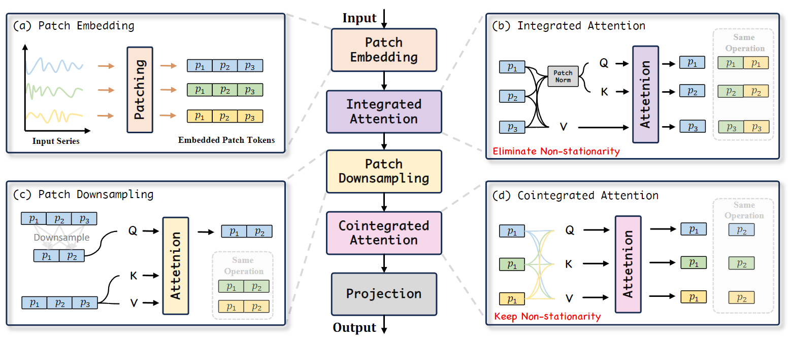

# 时序预测任务

## 三种类型时间序列建模方法  

### 基础时间序列预测建模  

> 每个时间序列独立建模，不考虑各序列间的关系  
> 优先考虑先验性较强的RNN、CNN模型　　

基础时间序列预测建模方法主要包括自回归模型（AR）、移动平均模型（MA）和自回归移动平均模型（ARMA）。
- 自回归模型（AR）：自回归模型是一种基于序列自身历史值的预测模型，它假设当前值与过去一段时间内的值之间存在线性关系。自回归模型通过将当前值与过去一段时间内的值进行线性组合来预测未来值。  
- 移动平均模型（MA）：移动平均模型是一种基于序列的误差项的预测模型，它假设当前值与过去一段时间内的误差项之间存在线性关系。移动平均模型通过将当前值与过去一段时间内的误差项进行线性组合来预测未来值。  
- 自回归移动平均模型（ARMA）：自回归移动平均模型结合了自回归模型和移动平均模型的优点，它假设当前值与过去一段时间内的值和误差项之间存在线性关系。自回归移动平均模型通过将当前值与过去一段时间内的值和误差项进行线性组合来预测未来值。 
- ARIMA模型（自回归积分滑动平均模型）：ARIMA模型是一种扩展的自回归移动平均模型，它通过引入差分操作来处理非平稳时间序列。ARIMA模型通过将当前值与过去一段时间内的值和误差项进行线性组合，并通过差分操作来处理非平稳性，从而预测未来值。  

### 时空预测　　

> 基于空间位置和时间的预测，相比基础时间预测任务增加了空间维度  
> 同时考虑各序列间的相互影响关系实现更准确的预测    

例如站点客流量，站点的空间相对/绝对位置关系和客流量有很强关系  

主要有三种架构：**融合、串联、并联**

#### 融合架构  

> 基础时间序列预测模型和时空预测模型融合，在每一时间步的计算中都引入了其他序列的特征信息    
> 例如：LSTM+CNN
#### 串联架构  

+ 时间序列模型先给每个节点的时间序列独立建模
+ 得到每个节点的序列表征后
+ 再作为图神经网络的输入
+ 图网络的输出又作为下一层时间序列网络的输入
#### 并联架构

+ 输入序列同时输入到时间网络和空间网络，分别进行计算  
+ 一般采用“门”控制时间网络和空间网络信息流入  
+ 融合后的结果作为下一层时间、空间网络的输入  

#### 多元时间序列预测
多元时间序列预测中，从多变量建模方法的维度有两种类型，**独立预测**和**联合预测**。
##### 独立预测
+  把多元序列当成多个单变量预测，每个变量分别建模    

##### 联合预测  
+  多变量一起建模，考虑各个变量之间的关系   
  
> 独立预测方法在大多数任务上表现更好，真实数据往往存在distribution drift(分布偏移)，独立预测方法有助于缓解这个问题，提升模型泛化性  
> 联合建模的优化方法包括**正则化、低秩性、损失函数优化**

### 层次预测  

> 待预测数据存在层次结构，且父节点的序列值和子节点的序列值有和约束的场景下  

例如销量预测，每个产品的销量预测，可以汇聚成品类的销量，品类的销量可以汇聚成店铺的销量  
+ 不同层次的销量，越往上层，序列越平滑，可预测性越强  
+ 越往下层，序列噪声越大，但信息量越多  
+ 通过层次预估，**融合各层次序列的优势**，得到更准确地预测结果  

## 平稳时序预测  

## 非平稳时序预测

非平稳性是时间序列中普遍存在的特性，即序列的统计属性（如均值、方差）随时间变化，导致序列的分布并不固定。
非平稳性通常表现为以下几种形式：
- 均值漂移：序列的均值随时间变化，导致序列的分布逐渐偏移。
- 方差漂移：序列的方差随时间变化，导致序列的分布逐渐扩散或收缩。
- 季节性：序列的统计属性随时间周期性变化，如季节性、周期性等。

### 虚假回归  

+ 非平稳的存在可能导致所谓的**“虚假回归”（Spurious Regression）**。虚假回归是指当两个无实际相关性的时间序列都存在趋势性增长或减少时，简单线性回归会错误得出两者相关的结论。在短期预测建模中，这种现象尤为显著。短期内频繁而剧烈的波动使模型容易误以为某些无关的变化存在相关性，进而干扰模型对真实短期结构的捕捉。此外，在处理高维多元时间序列时，如果不对非平稳因素加以区分与剔除，就可能在跨变量的短期建模中埋下误判的隐患。因此，在短期建模中，适当去除非平稳性对提升预测的可信度和减小虚假关系影响至关重要。

### 协整关系与长期依赖建模  

+ 协整（Cointegration）是指两个或多个非平稳序列的线性组合可能呈现平稳特性，这意味着这些序列在长期范围内存在某种稳定均衡关系。例如，气温与露点温度、或某些股票行业指数间的长期动态变化可能存在稳定比例关系。即使这些时间序列单独来看并不平稳，但它们之间的差异或线性组合却可能是平稳的，从而揭示出长期的潜在关联。

+ 在长期预测中，若只顾及短期的高频噪声和非平稳特征，往往会忽略长期依赖结构。保留非平稳性有助于在时间序列的长时间跨度上找到这种协整关系，从而在预测中利用更深层的长期结构特征。与短期过度拟合不同的是，长期建模强调在长时间段内寻找稳定关系，这使得保留非平稳性成为长期建模的关键策略。通过在合适的阶段与尺度上重视非平稳性特征，模型可以更好地从多元序列中提炼出稳定的长期依赖关系，避免因为盲目消除非平稳性而错失这些协整信号。  

### 通道独立与通道依赖建模方法  

+ 通道独立（Channel-Independent，CI）方法只对每个变量自身历史进行预测，避免跨变量的交互建模。这类方法适合短期快速变化场景，因为无须考虑不同变量之间复杂的短期相关性，从而减小模型复杂度、降低短期虚假相关的风险。然而，这类方法在长期建模时，可能错过跨变量的潜在协整关系。

+ 通道依赖（Channel-Dependent，CD）方法则积极利用多个变量间的相互作用进行预测，尤其
  + **在变量数目较多、潜在协整关系强烈的情境中，CD方法更具优势**。这类方法在长期预测时有机会发掘跨变量的长期均衡关系，提高预测精度和稳定性。
  + 但在短期背景下，CD方法容易受到非平稳性和短期噪声影响，从而增加虚假回归的风险。
  + 在时间序列预测中，短期建模更适合通道独立和去非平稳处理，从而锁定短期内单变量的时序结构；长期建模则更适宜保留非平稳性并采用通道依赖策略，以挖掘多变量之间的长期均衡关系。

### 三级标题

- 无序列表项1
- 无序列表项2
- 无序列表项

1. 有序列表项1
2. 有序列表项2
3. 有序列表项3

**加粗文本**

*斜体文本*

`代码片段`

# 代码块
def hello_world():
    print("Hello, World!")

[链接文本](https://www.example.com)

> 引用文本

| 表头1 | 表头2 |
|-------|-------|
| 单元格1 | 单元格2 |
| 单元格3 | 单元格4 |

- [ ] 待办事项1
- [x] 已完成待办事项2

# 总结

这是一份Markdown模板，包含了常用的Markdown语法元素。

