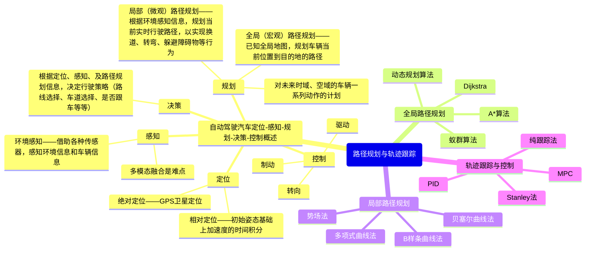
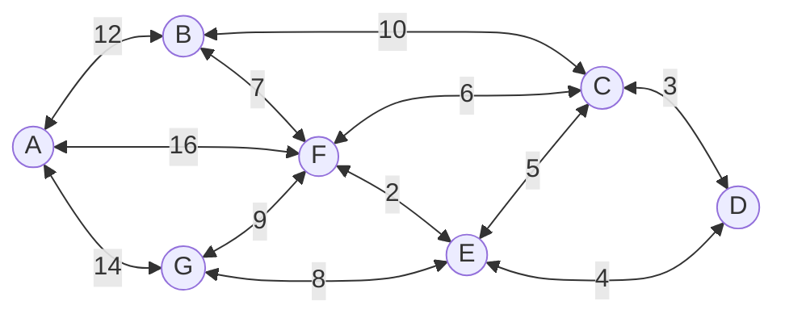

<style>@import url(../auto_number_title.css); </style>
<link rel="stylesheet" href="https://cdn.jsdelivr.net/npm/pseudocode@latest/build/pseudocode.min.css">
<script src="https://cdn.jsdelivr.net/npm/pseudocode@latest/build/pseudocode.min.js"></script>

# Pathing Planning(路径规划)
+ 基于搜索的路径规划
+ 基于采样的路径规划





## 基于搜索的路径规划

通过搜索图形结构来找到最短或最优的路径，其中 A\* 是最为常用和经典的算法之一

### BFS(Breadth-First Searching，广度优先搜索)
  + 优点：可找到最短路径；适用于无权图
  + 缺点：时间复杂度高；空间复杂度高

### DFS(Depth-First Searching，深度优先搜索)


  + 优点：空间复杂度低
  + 可能会陷入死循环；不一定能找到最短路径
 
### Best-First Searching(最佳优先搜索)
  + 优点：速度快；可以处理启发式信息
  + 缺点：可能会陷入局部最优解
 
### <font color=Red>**Dijkstra**</font>

一种用于求解图中单源最短路径问题的经典算法，可以用来找到从一个顶点到其他所有顶点的最短路径。可以应用于有向图或无向图。该算法通过不断更新起点到各个顶点的最短路径来找到最终的最短路径。Dijkstra算法的时间复杂度为$O(V^2)$，其中V为顶点数，但可以通过优先队列实现最小堆来优化时间复杂度。


+ 算法思想
  + 设G=(V,E)是一个带权有向图，把图中节点集合分为两组，<font color=Red>第一组为已求出最短路径的节点集合</font>（用S表示，初始时S中只有一个源点，以后每求得一条最短路径，就将该节点加入到S中，知道全部节点都加入S）
  + <font color=Red>第二组为其余未确定最短路径的节点集合</font>（用U表示），按最短路径递增次序依次把第二组节点加入S中
    + 初始时，S只包含起点s，U包含除s以外的其他节点，U中节点v和s不相邻则距离为$\infity$
    + 从U中选出“距离最短的节点k”，将k移入S中，并从U中移除k
    + 更新U中各节点到起点s的距离，利用k更新其他节点的距离（(s,v)可能大于(s,k)+(k,v)）
    + 重复步骤2、3，直到遍历所有节点
  
  
  + 优点：可以找到最短路径；适用于有权图
  + 缺点：时间复杂度高；不能处理负权边

### <font color=Red>**A\***</font>

A\*算法是一种启发式搜索算法，它结合了Dijkstra算法和贪婪最佳优先搜索算法的优点。A\*算法通过估计从当前节点到目标节点的代价来动态调整搜索方向，从而更快地找到最佳路径。


  + 优点：速度快；可以处理启发式信息；可以找到最短路径
  + 缺点：可能会陷入局部最优解

### Bidirectional A\*
  + 优点：速度快；可以找到最短路径
  + 缺点：需要存储两个搜索树；可能会出现问题，例如搜索空间过大或搜索树生长过慢

### Anytime Repairing A\*


  + 优点：可以在任何时候停止搜索并返回最佳路径；可以处理启发式信息
  + 缺点：可能会陷入局部最优解

### Learning Real-time A\* (LRTA*，实时学习 A\*)
  + 优点：可以处理动态环境；可以处理启发式信息。
  + 缺点：需要进行实时计算，可能会导致性能问题

### Real-time Adaptive A\* (RTAA\*，实时自适应 A\*)
  + 优点：可以处理动态环境；可以处理启发式信息
  + 缺点：需要进行实时计算，可能会导致性能问题

### Lifelong Planning A\* (LPA\*，终身规划 A\*)
  + 优点：可以在不同的时间段进行搜索；可以处理启发式信息
  + 缺点：需要存储大量的搜索树

### Dynamic A\* (D\*，动态 A\*)
  + 优点：可以处理动态环境；可以处理启发式信息
  + 缺点：需要存储大量的搜索树。

### D* Lite
  + 优点：可以处理动态环境；可以处理启发式信息；空间复杂度低
  + 缺点：可能会陷入局部最优解。

### Anytime D*
  + 优点：可以在任何时候停止搜索并返回最佳路径；可以处理动态环境；可以处理启发式信息
  + 缺点：可能会陷入局部最优解。

## 基于采样的路径规划

适用于复杂环境中的路径规划，如机器人导航、无人驾驶和物流配送等领域

### <font color=Red>RRT(Rapidly-Exploring Random Trees, 快速探索随机树)</font>
  RRT（Rapidly-exploring Random Tree）算法是一种适用于高维空间的路径规划算法，它通过随机采样和不断扩展树形结构来搜索路径
  

  + 优点：适用于高维空间；能够有效处理复杂环境；运算速度较快
  + 缺点：无法保证找到最优解；生成的路径可能不是最短路径;算法的运算效率不高，随机树搜索漫无目的
<p align='center'>

</p>

  + RANDOM_STATE()函数在设定的环境内部产生随机点
  + NEAREST_NEIGHBOR()函数遍历随机树，找出距离随机点最近的节点
  + SELECT_INPUT()函数按照已设定好的值扩展随机树
  + NEW_STATE()函数生成 
  + judge($x_{new}$)函数判断新生成的节点是否满足非完整约束
  + T.add_vertex()插入$x_{new}$
  + T .add _ edge()为$x_{near}$到$x_{new}$之间加上一条边

### Goal-Biased RRT(基于目标的RRT算法)
  为了高算法的效率，希望随机树的搜索并不是完全漫无目的的，希望随机树尽可能向着目标方向搜索，以加快搜索速度。
具体的操作方法是：人为的引导随机点的生成。在产生随机点$x_{rand}$时，以一定的概率选取目标点作为循环中的$x_{rand}$，即$x_{rand}=x_{goal}$。
$x_{rand}$在随机树扩展中相当于给定一个扩展的方向，以一定的概率将目标点作为$x_{rand}$，就等价于驱使随机树向着目标方向扩展，将图1展示的算法流程中RANDOM_STATE()函数改写为如下形式：
<p align='center'>

</p>

### RRT-Connect
  + 优点：可以保证找到可行路径；适用于多机器人路径规划问题
  + 缺点：路径质量可能较差；可能收敛速度较慢。
### Extended-RRT
  + 优点：能够处理非完整动力学系统；适用于多机器人协同规划
  + 缺点：路径质量可能较差；运算速度较慢
### Dynamic-RRT

  + 优点：能够处理动态环境中的路径规划问题；适用于移动机器人和无人机等领域
  + 缺点：运算速度较慢；路径质量可能较差
 
```python
# --------Visualization specialized for dynamic RRT
    def visualization(self):
        if self.ind % 100 == 0 or self.done:
            V = np.array(self.V)
            Path = np.array(self.Path)
            start = self.env.start
            goal = self.env.goal
            # edges = []
            # for i in self.Parent:
            #     edges.append([i, self.Parent[i]])
            edges = np.array([list(i) for i in self.Edge])
            ax = plt.subplot(111, projection='3d')
            # ax.view_init(elev=0.+ 0.03*initparams.ind/(2*np.pi), azim=90 + 0.03*initparams.ind/(2*np.pi))
            # ax.view_init(elev=0., azim=90.)
            ax.view_init(elev=90., azim=0.)
            ax.clear()
            # drawing objects
            draw_Spheres(ax, self.env.balls)
            draw_block_list(ax, self.env.blocks)
            if self.env.OBB is not None:
                draw_obb(ax, self.env.OBB)
            draw_block_list(ax, np.array([self.env.boundary]), alpha=0)
            draw_line(ax, edges, visibility=0.75, color='g')
            draw_line(ax, Path, color='r')
            # if len(V) > 0:
            #     ax.scatter3D(V[:, 0], V[:, 1], V[:, 2], s=2, color='g', )
            ax.plot(start[0:1], start[1:2], start[2:], 'go', markersize=7, markeredgecolor='k')
            ax.plot(goal[0:1], goal[1:2], goal[2:], 'ro', markersize=7, markeredgecolor='k')
            # adjust the aspect ratio
            set_axes_equal(ax)
            make_transparent(ax)
            # plt.xlabel('s')
            # plt.ylabel('y')
            ax.set_axis_off()
            plt.pause(0.0001)
if __name__ == '__main__':
    rrt = dynamic_rrt_3D()
    rrt.Main()
```

### RRT*(Rapidly-Exploring Random Trees Star, 快速探索随机树星)
  + 优点：能够找到最优路径；路径质量较高
  + 缺点：运算速度较慢；可能需要大量的存储空间
### Informed RRT*
  + 优点：结合了启发式信息，能够加速搜索过程；能够找到近似最优解
  + 缺点：运算速度较慢；路径质量可能较差
### RRT* Smart
  + 优点：通过智能采样策略提高搜索效率；能够找到最优路径
  + 缺点：运算速度较慢；路径质量可能较差

 ```python
class Node:
    def __init__(self, n):
        self.x = n[0]
        self.y = n[1]
        self.parent = None

class RrtStarSmart:
    def __init__(self, x_start, x_goal, step_len,
                 goal_sample_rate, search_radius, iter_max):
        self.x_start = Node(x_start)
        self.x_goal = Node(x_goal)
        self.step_len = step_len
        self.goal_sample_rate = goal_sample_rate
        self.search_radius = search_radius
        self.iter_max = iter_max

        self.env = env.Env()
        self.plotting = plotting.Plotting(x_start, x_goal)
        self.utils = utils.Utils()

        self.fig, self.ax = plt.subplots()
        self.delta = self.utils.delta
        self.x_range = self.env.x_range
        self.y_range = self.env.y_range
        self.obs_circle = self.env.obs_circle
        self.obs_rectangle = self.env.obs_rectangle
        self.obs_boundary = self.env.obs_boundary

        self.V = [self.x_start]
        self.beacons = []
        self.beacons_radius = 2
        self.direct_cost_old = np.inf
        self.obs_vertex = self.utils.get_obs_vertex()
        self.path = None

    def planning(self):
        n = 0
        b = 2
        InitPathFlag = False
        self.ReformObsVertex()

        for k in range(self.iter_max):
            if k % 200 == 0:
                print(k)

            if (k - n) % b == 0 and len(self.beacons) > 0:
                x_rand = self.Sample(self.beacons)
            else:
                x_rand = self.Sample()

            x_nearest = self.Nearest(self.V, x_rand)
            x_new = self.Steer(x_nearest, x_rand)

            if x_new and not self.utils.is_collision(x_nearest, x_new):
                X_near = self.Near(self.V, x_new)
                self.V.append(x_new)

                if X_near:
                    # choose parent
                    cost_list = [self.Cost(x_near) + self.Line(x_near, x_new) for x_near in X_near]
                    x_new.parent = X_near[int(np.argmin(cost_list))]

                    # rewire
                    c_min = self.Cost(x_new)
                    for x_near in X_near:
                        c_near = self.Cost(x_near)
                        c_new = c_min + self.Line(x_new, x_near)
                        if c_new < c_near:
                            x_near.parent = x_new

                if not InitPathFlag and self.InitialPathFound(x_new):
                    InitPathFlag = True
                    n = k

                if InitPathFlag:
                    self.PathOptimization(x_new)
                if k % 5 == 0:
                    self.animation()

        self.path = self.ExtractPath()
        self.animation()
        plt.plot([x for x, _ in self.path], [y for _, y in self.path], '-r')
        plt.pause(0.01)
        plt.show()

    def PathOptimization(self, node):
        direct_cost_new = 0.0
        node_end = self.x_goal

        while node.parent:
            node_parent = node.parent
            if not self.utils.is_collision(node_parent, node_end):
                node_end.parent = node_parent
            else:
                direct_cost_new += self.Line(node, node_end)
                node_end = node

            node = node_parent

        if direct_cost_new < self.direct_cost_old:
            self.direct_cost_old = direct_cost_new
            self.UpdateBeacons()

    def UpdateBeacons(self):
        node = self.x_goal
        beacons = []

        while node.parent:
            near_vertex = [v for v in self.obs_vertex
                           if (node.x - v[0]) ** 2 + (node.y - v[1]) ** 2 < 9]
            if len(near_vertex) > 0:
                for v in near_vertex:
                    beacons.append(v)

            node = node.parent

        self.beacons = beacons

    def ReformObsVertex(self):
        obs_vertex = []

        for obs in self.obs_vertex:
            for vertex in obs:
                obs_vertex.append(vertex)

        self.obs_vertex = obs_vertex

    def Steer(self, x_start, x_goal):
        dist, theta = self.get_distance_and_angle(x_start, x_goal)
        dist = min(self.step_len, dist)
        node_new = Node((x_start.x + dist * math.cos(theta),
                         x_start.y + dist * math.sin(theta)))
        node_new.parent = x_start

        return node_new

    def Near(self, nodelist, node):
        n = len(self.V) + 1
        r = 50 * math.sqrt((math.log(n) / n))

        dist_table = [(nd.x - node.x) ** 2 + (nd.y - node.y) ** 2 for nd in nodelist]
        X_near = [nodelist[ind] for ind in range(len(dist_table)) if dist_table[ind] <= r ** 2 and
                  not self.utils.is_collision(node, nodelist[ind])]

        return X_near

    def Sample(self, goal=None):
        if goal is None:
            delta = self.utils.delta
            goal_sample_rate = self.goal_sample_rate

            if np.random.random() > goal_sample_rate:
                return Node((np.random.uniform(self.x_range[0] + delta, self.x_range[1] - delta),
                             np.random.uniform(self.y_range[0] + delta, self.y_range[1] - delta)))

            return self.x_goal
        else:
            R = self.beacons_radius
            r = random.uniform(0, R)
            theta = random.uniform(0, 2 * math.pi)
            ind = random.randint(0, len(goal) - 1)

            return Node((goal[ind][0] + r * math.cos(theta),
                         goal[ind][1] + r * math.sin(theta)))

    def SampleFreeSpace(self):
        delta = self.delta

        if np.random.random() > self.goal_sample_rate:
            return Node((np.random.uniform(self.x_range[0] + delta, self.x_range[1] - delta),
                         np.random.uniform(self.y_range[0] + delta, self.y_range[1] - delta)))

        return self.x_goal
```

### Anytime RRT*
  + 优点：可以在任何时候停止搜索并返回当前的最佳路径；能够找到近似最优解
  + 缺点：路径质量可能较差；需要进行实时计算
### Closed-Loop RRT*
  
  + 优点：能够处理非完整动力学系统和约束条件；路径质量较高
  + 缺点：运算速度较慢；可能需要大量的存储空间
### Spline-RRT*
  + 优点：通过样条插值提高路径质量；能够找到平滑的路径
  + 缺点：运算速度较慢；可能需要大量的存储空间
### Fast Marching Trees (FMT*)

  + 优点：运算速度快；能够找到最短路径
  + 缺点：路径质量可能较差；在高维空间中效果可能不理想
### Batch Informed Trees (BIT*)
  + 优点：通过批量采样提高搜索效率；能够找到最优路径
  + 缺点：运算速度较慢；可能需要大量的存储空间


<script>
    pseudocode.renderClass("pseudocode");
</script>
