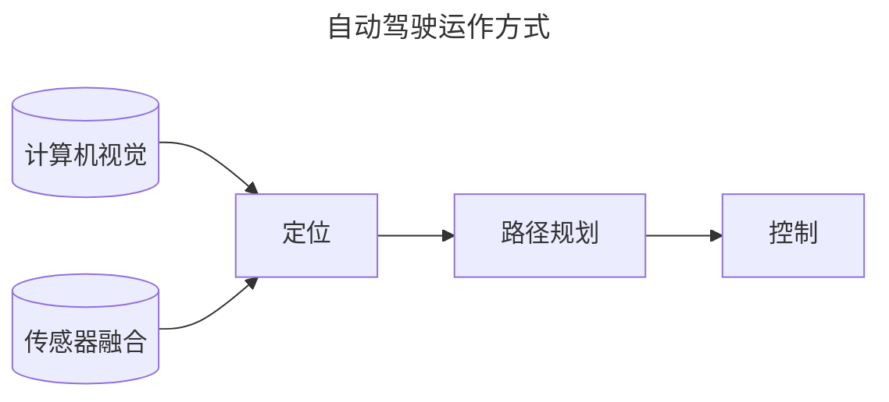
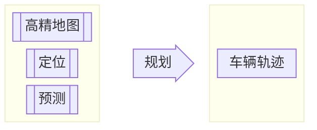
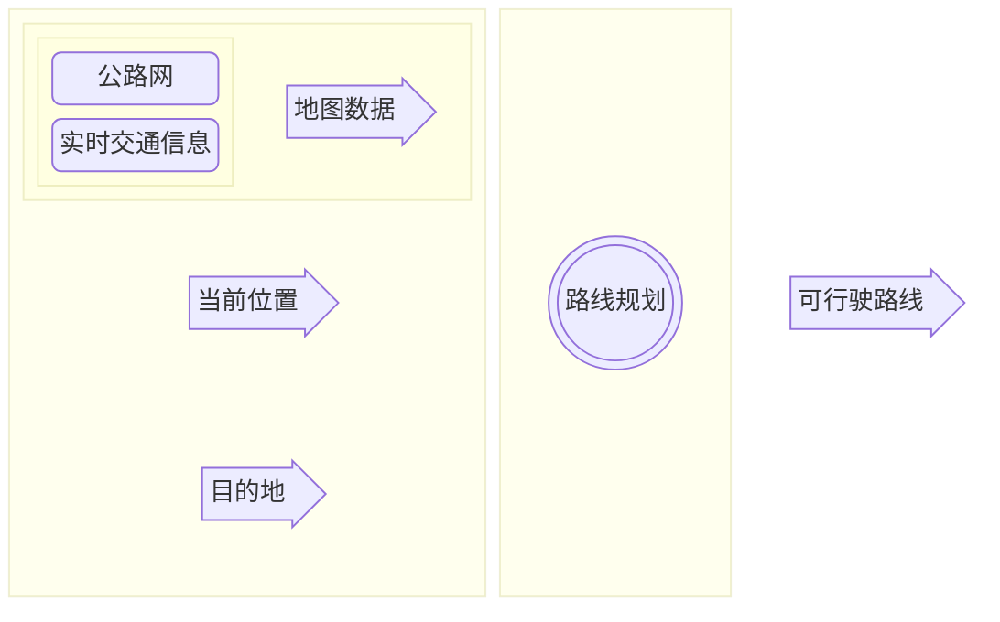
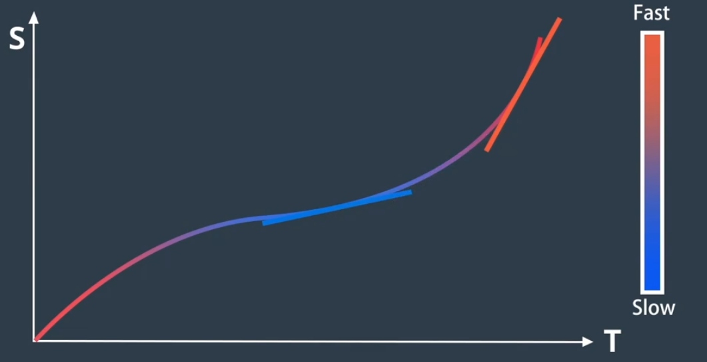
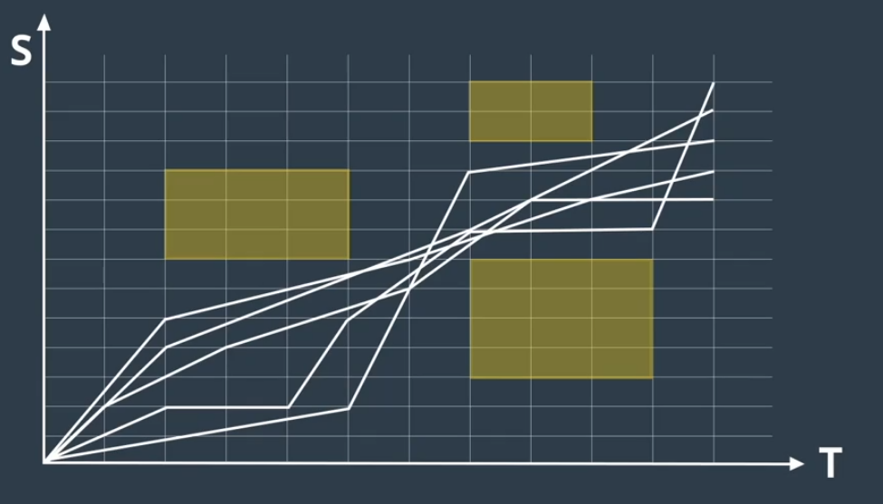
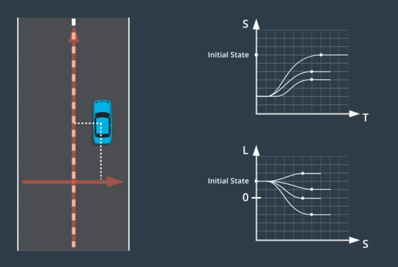
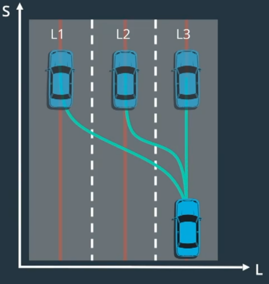

<style>@import url(../../css/auto-number-title.css); </style>

# 自动驾驶技术

## 概览

### 运作方式


> + 计算机视觉：相机  
>   + 建立视觉理解，识别周围环境、物体是什么  
>   + 也可实现较低精度的距离测量 
> + 传感器融合：激光雷达lidar、电磁波雷达radar  
>   + 增加周围物体距离数据、速度数据  
> + 定位：自身精确位置、环境高精地图  
>   + 测量自身与地标（环境中的标志性物体）的距离，与环境地图比较，获得自身位置
> + 路径规划：建立到达目的地的路线  
>   + 建立路径规划器
>       + **预测**其他运动物体的路径
>       + **推算**自身车辆应对措施，建立自身路径
>       + **决策**自身运动，加减速、转向等，受限于速度、加速度等约束条件
> + 控制：沿规划路径行驶时车辆油门、转向、刹车等控制

### Apollo架构

1. reference vehicle platform（参考车辆）
2. reference hardware platform（参考硬件平台）

<p align='center'><br>参考车辆与参考硬件平台</p>

3. open software platform（开放软件平台）
分为三个子层
    + 实时操作系统层(Apollo RTOS)  
      + 实时计算、分析、执行相应操作 
      + ubuntu + apollo 内核 = apollo real time operate system(Apollo RTOS)  
    + 运行时框架层 
      +  是apollo的操作环境  
      +  是ROS（robot operate system）定制版
         + **共享内存**
           + 一次写入，多次读取，数据应用到多个功能模块，同时用于检测、定位、GUI等 
         + **去中心化**
           + 多节点放入公共域，每个节点包含其他节点信息
           + protobuf替代原生ROS message解决通信数据格式兼容性
      +  是Apollo RTOS上运行的软件框架
    + 应用程序模块层 
      + MAP engine（地图引擎）  
      + localization（定位）  
      + perception（感知）  
      + planning（规划）  
      + control（控制）  
      + end to end driving（端到端驾驶）  
      + human machine interface（人机接口）  
4. cloud service platform  
    + 高精地图  
    + 仿真环境 
      + 配置不同的驾驶环境（路型、障碍物、路线、交通灯等等）  
      + 场景运行模式  
        + 多场景并发
        + 单个/多个模块的算法验证
      + 自动评估系统  

        |评估标准||
        |---|---|
        |碰撞检测|闯红灯检测|
        |限速检测|在路检测|
        |到达终点检测|急刹检测|
        |加速度检测|导航检测|
        |路口变道检测|礼让行人检测|
        |不必要刹车检测|停车标志前停车检测|

      + 三维可视化实时路况
        + 实时路况
          + 车道
          + 交通灯
          + 限速
        + 算法输出的可视化信息
          + 路径规划
          + 动态障碍物
          + 无人车规划轨迹
        + 车自身状态信息
          + 速度
          + 方向
          + 刹车油门状态
    + 数据平台  
      + 数据来源  
        + 模拟场景  
        + 记录场景  
      + 数据类型  
        + 交通信号灯数据（定位）  
        + 带边界框的障碍物数据（定位+分类）  
        + 语义分割数据（像素级分类）  
      + ApolloScape数据集
    + 安全  
    + Over-The-Air, OTA  
    + 智能语音系统DuerOS

## 高精地图  

## 定位  

## 感知  

## 预测  

## 规划

### 简介



### 路线规划（Route planning）  
> + **全局路径规划，侧重于如何从地图上的A前往B**  
  


1. 世界到图  
   + 将地图数据格式化为“graph”数据结构  
     + 把线抽象成点，把点精细成线  
     + **节点**：表示路段  
     + **边**：表示路段间的连接  
2. 网格/graph(以A*算法为例)  
   + 计算初始节点到候选节点的成本$g$   
     + 现实世界表示当前位置到下一候选位置的困难程度
   + 计算候选节点到目的地的估计成本（启发式成本）$h$  
     + 现实世界表示候选位置到目的地的距离
   + $minimize\{f=g+h\}$  

> **[!NOTE]**  
> 从路线到轨迹

### 轨迹规划（Trajectory planning）  
> + **局部路径规划，细致决策以生成免碰撞和舒适的可行驶轨迹**  
>   + 该轨迹由一系列点定义
>     + 每个点都有一个关联速度
>     + 每个点都有到达此点的时间戳（X,Y,T）

1. 轨迹评估
   + 评估轨迹是否满足车辆动力学和物理约束
   + 评估轨迹是否安全、舒适、高效
2. 轨迹选择  
   + 成本函数：选择成本最低的轨迹  
     + 偏离路中心程度  
     + 潜在碰撞风险  
     + 超出速度限制  
     + 轨迹曲率和加速度影响乘客舒适性  
   + 不同场景使用不同的成本函数   
     + 应对不同驾驶风格和驾驶场景  
3. Frenet坐标系  
   > + 将车道抽象为一条直线，将车辆轨迹抽象为一条曲线  
   + <p align='left'></p>  
       
     + 纵坐标表示在道路中的行驶距离  
     + 横坐标表示汽车偏离中心线的距离  

4. 路径-速度解耦规划方法  
   + 路径规划
     + 生成车辆可行驶的候选路径曲线  
       > 使用成本函数进行评估  
     + 路径生成与选择  
       + 基于图搜索的方法
         + 将路段分割成单元格  
         + 对每个单元格内的点随机采样一个点  
         + 将每个点按位置顺序连接起来  
         + 重复以上过程构建多个候选路径   
         + 使用**成本函数**对这些路径进行评估  
<font color="red">   
            > + **与车道中心的偏离**  
            > + **与碰撞物的距离**  
            > + **速度和曲率的变换**  
            > + **对车辆的压力**  
            > + **...**  
</font>  
       + 基于空间采样的方法  
       + 基于参数曲线的方法  
       + 基于数值最优化方法  
       + 基于轨迹择优的方法  
   + 速度规划  
     > **<font color="red">速度曲线</font>**：在路径上每个点上的速度，速度序列  
     + ST图  
       > + <p align='left'></p>  
         > + 纵坐标表示沿路径位移  
         > + 横坐标表示时间  
         > + 斜率表示速度  
       1. 将ST图离散为多个单元格  
          > 单元格内速度恒定  
       2. 将障碍物绘制为特定时间段内阻挡道路的矩形  
          > + <p align='left'></p>  
       3. 优化算法依据约束条件选择最佳速度曲线  
          1. 法律约束  
             1. 速度限制  
          2. 距离限制  
             1. 与障碍物距离  
          3. 物理限制  
             1. 加速度限制  
   + 平滑离散线段  
     + 离散化  
       > + 路径规划涉及将道路划分为单元格  
       > + 速度规划涉及将ST图划分为单元格  
     + **<font color="red">二次规划</font>**  
       > + 离散方案转换为平滑轨迹  
   + 轨迹生成  
     + 将路径曲线和速度曲线合并构建轨迹  
5. Lattice规划方法  
   ```mermaid
   flowchart LR
      A[空间环境] --> B[Frenet坐标系] --投射--> C[横轴]
      B --投射--> D[纵轴]
      subgraph 三维轨迹
        direction TB
        E[纵向维度]
        G[时间维度]
        F[横向维度]
        E --> G
        G --> F
      end
      C --> 三维轨迹
      D --> 三维轨迹
      subgraph 两个独立二维问题
        direction TB
        H[**ST轨迹图**<br>带有时间戳的纵向轨迹]
        I[**SL轨迹图**<br>相对纵向轨迹的横向偏移]
        H <--> I
      end
      三维轨迹 ==分解==> 两个独立二维问题
   ```
   <p align='center'></p>  
  
     > *建立ST轨迹图——随时间变化的纵向位移*  
     > *建立SL轨迹图——纵向轨迹上每个点的横向偏移*  
     > *选取代价函数最小的轨迹图*
   + ST轨迹终止状态  
     + 巡航  
       + 对图上的点进行采样  
         + 横轴时间  
         + 纵轴速度  
       > *完成规划步骤后定速行驶*  
     + 跟随  
       + 需同时对时间和位置进行采样  
       + 满足在`t`时刻出现在某车后指定位置  
       + 跟随时保持安全距离  
         > *速度和加速度取决于所跟随车辆*  
     + 停止  
       >  对何时何地停止进行采样  
   + SL轨迹终止状态  
     > *假设：任何轨迹停止状态，车辆都稳定与车道中心线对齐*
     > <p align='left'></p>
     + 车的朝向和位置的一阶、二阶导数均为`0`  
       + $V_{Lateral Velocity}=0$
       + $V_{Lateral Acceleration}=0$   
   + 轨迹生成  
     + <p align='left'></p>
     
     ```mermaid
     graph LR
     subgraph 轨迹图
       direction TB
       A[ST轨迹图]
       B[SL轨迹图]
       A ~~~ B
     end
     轨迹图 ==通过S值匹配合并==> C[笛卡尔坐标系]

     ```
     > + **对于换道场景，Lattice算法对目标车道对应的参考线做一次采样+选择的流程**
     > + **本车道和目标车道均能产生一条最优轨迹**
     > + **给换道轨迹的cost上增加额外的车道优先级的cost，再将两条轨迹比较，选择cost较小的那条即可**
   
## 控制  
### 简介  
> 控制是驱使车辆前行的策略  

+ 控制器的要求
  1. 控制其必须精准，避免偏离目标轨迹  
  2. 控制策略必须具备可行性  
  3. 考虑平稳性、舒适性 ，驱动应当连续  

+ **<font color="red">控制流程</font>**  

  ```mermaid
  ---
  config:
    theme: default
    themeVariables:
      fontFamily: 'Times new Roman'
      fontSize: 14px
  ---
  block-beta
  columns 5
    block:block00:1
      A((("规划模块")))
    end

    blockArrowId1<["目标轨迹"]>(right):1

    block:block02:1
      D((("&nbsp;&nbsp;控制器&nbsp;&nbsp;")))
    end

    blockArrowId2<["车辆状态"]>(left):1
    block:block03:1
      columns 1
      F((("&nbsp;&nbsp;定位模块&nbsp;&nbsp;")))
      G((("内部传感器")))
    end
    space:5
    space:1
    block:block04:3
      columns 3
      H("转向"):1
      I("加速"):1
      J("制动"):1
    end
    space:1
    space:5
    E("实际轨迹"):5
    
    block02--"控制器输出的是控制输入"-->block04
    block04--"使车辆通过目标路径点"-->E
    E --"实际轨迹"-->block03
  ```
  
  + **目标轨迹**：由规划模块生成，包含一系列路径点  
    + 每个路径点指定一个位置 $(x,y)$ 和一个参考速度 $v$  
    + 每个时间步都对轨迹进行更新  
  + **车辆状态**：由定位模块和内部传感器获取
    + 车辆当前位置、速度、加速度、转向等  

### PID
> + *Proportion Integration Differentiation，比例积分微分控制*  
> + 线性算法，对于复杂系统效果不佳  
>   + 需要建立不同的PID控制器控制不同的物理量（转向、加速等），难以将横向控制和纵向控制结合  
>   + 依赖于实时误差测量，实时性难以保证  
+ 比例控制  
  + 致力于使运动达到目标速度
  + $a=-K_{p}e$  
+ 微分控制  
  + 致力于使运动处于稳定状态  
  + $a=-K_{p}e-K_{d}\frac{de}{dt}$  
    + 增加阻尼项减少控制器输出的变化速度  
+ 积分控制  
  + 负责纠正系统性错误,对系统累积误差进行惩罚  
  + $a=-K_{p}e-K_{d}\frac{de}{dt}-K_{i}\int edt$


### LQR
> Linear Quadratic Regulator，线性二次调节器


### MPC
> Model Predictive Control，模型预测控制

