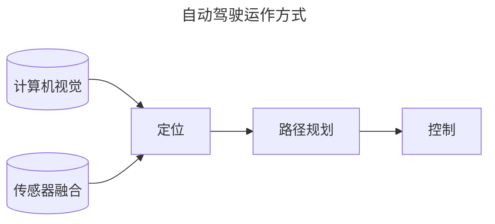
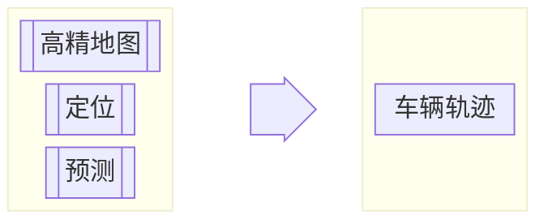
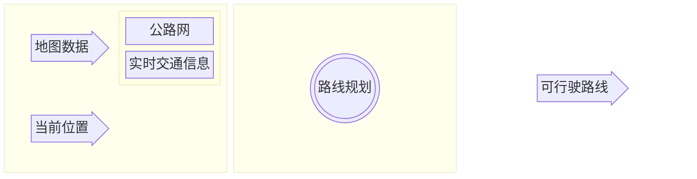

# 自动驾驶技术

## 概览

### 运作方式

> + 计算机视觉：相机  
>   + 建立视觉理解，识别周围环境、物体是什么  
>   + 也可实现较低精度的距离测量 
> + 传感器融合：激光雷达lidar、电磁波雷达radar  
>   + 增加周围物体距离数据、速度数据  
> + 定位：自身精确位置、环境高精地图  
>   + 测量自身与地标（环境中的标志性物体）的距离，与环境地图比较，获得自身位置
> + 路径规划：建立到达目的地的路线  
>   + 建立路径规划器
>       + **预测**其他运动物体的路径
>       + **推算**自身车辆应对措施，建立自身路径
>       + **决策**自身运动，加减速、转向等，受限于速度、加速度等约束条件
> + 控制：沿规划路径行驶时车辆油门、转向、刹车等控制

### Apollo架构

1. reference vehicle platform（参考车辆）
2. reference hardware platform（参考硬件平台）

 参考车辆与参考硬件平台

3. open software platform（开放软件平台）
分为三个子层
    + 实时操作系统层(Apollo RTOS)  
      + 实时计算、分析、执行相应操作 
      + ubuntu + apollo 内核 = apollo real time operate system(Apollo RTOS)  
    + 运行时框架层 
      +  是apollo的操作环境  
      +  是ROS（robot operate system）定制版
         + **共享内存**
           + 一次写入，多次读取，数据应用到多个功能模块，同时用于检测、定位、GUI等 
         + **去中心化**
           + 多节点放入公共域，每个节点包含其他节点信息
           + protobuf替代原生ROS message解决通信数据格式兼容性
      +  是Apollo RTOS上运行的软件框架
    + 应用程序模块层 
      + MAP engine（地图引擎）  
      + localization（定位）  
      + perception（感知）  
      + planning（规划）  
      + control（控制）  
      + end to end driving（端到端驾驶）  
      + human machine interface（人机接口）  
4. cloud service platform  
    + 高精地图  
    + 仿真环境 
      + 配置不同的驾驶环境（路型、障碍物、路线、交通灯等等）  
      + 场景运行模式  
        + 多场景并发
        + 单个/多个模块的算法验证
      + 自动评估系统  

        |评估标准||
        |---|---|
        |碰撞检测|闯红灯检测|
        |限速检测|在路检测|
        |到达终点检测|急刹检测|
        |加速度检测|导航检测|
        |路口变道检测|礼让行人检测|
        |不必要刹车检测|停车标志前停车检测|

      + 三维可视化实时路况
        + 实时路况
          + 车道
          + 交通灯
          + 限速
        + 算法输出的可视化信息
          + 路径规划
          + 动态障碍物
          + 无人车规划轨迹
        + 车自身状态信息
          + 速度
          + 方向
          + 刹车油门状态
    + 数据平台  
      + 数据来源  
        + 模拟场景  
        + 记录场景  
      + 数据类型  
        + 交通信号灯数据（定位）  
        + 带边界框的障碍物数据（定位+分类）  
        + 语义分割数据（像素级分类）  
      + ApolloScape数据集
    + 安全  
    + Over-The-Air, OTA  
    + 智能语音系统DuerOS

## 高精地图

## 定位

## 感知

## 预测

## 规划

### 简介

1. 路线规划（Route planning）  
+ 全局路径规划，侧重于如何从地图上的A前往B  
 

1. 轨迹规划（Trajectory planning）  
+ 局部路径规划，细致决策以生成免碰撞和舒适的可行驶轨迹  
  + 该轨迹由一系列点定义
    + 每个点都有一个关联速度
    + 到达此点的时间
 
## 控制