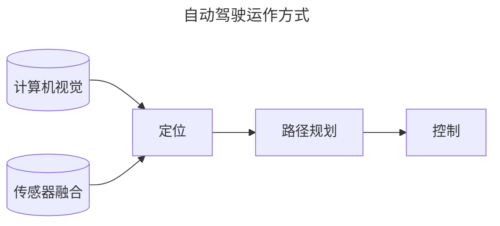

# 自动驾驶技术

## 概览

### 运作方式

> + 计算机视觉：相机  
>   + 建立视觉理解，识别周围环境、物体是什么  
>   + 也可实现较低精度的距离测量 
> + 传感器融合：激光雷达lidar、电磁波雷达radar  
>   + 增加周围物体距离数据、速度数据  
> + 定位：自身精确位置、环境高精地图  
>   + 测量自身与地标（环境中的标志性物体）的距离，与环境地图比较，获得自身位置
> + 路径规划：建立到达目的地的路线  
>   + 建立路径规划器
>       + **预测**其他运动物体的路径
>       + **推算**自身车辆应对措施，建立自身路径
>       + **决策**自身运动，加减速、转向等，受限于速度、加速度等约束条件
> + 控制：沿规划路径行驶时车辆油门、转向、刹车等控制

### Apollo架构

1. reference vehicle platform（参考车辆）
2. reference hardware platform（参考硬件平台）

 参考车辆与参考硬件平台

3. open software platform（开放软件平台）
分为三个子层
    + 实时操作系统层(Apollo RTOS)  
      + 实时计算、分析、执行相应操作 
      + ubuntu + apollo 内核 = apollo real time operate system(Apollo RTOS)  
    + 运行时框架层 
      +  apollo的操作环境，ROS（robot operate system）定制版
      +  Apollo RTOS上运行的软件框架
    + 应用程序模块层  

1. cloud service platform