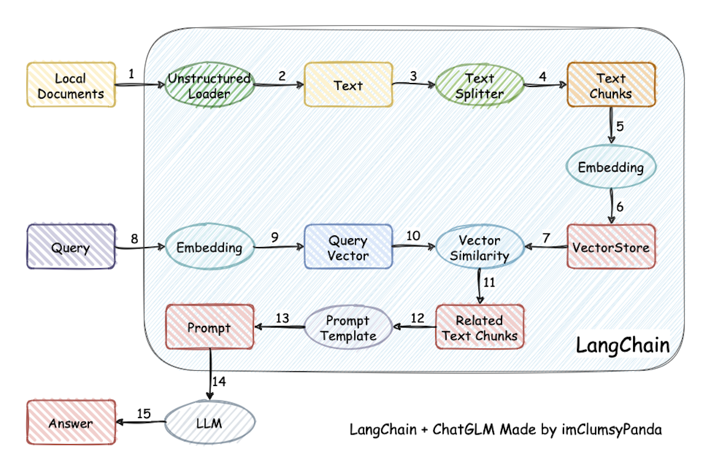

# PDSD-Chat

---

---

---

## 模型训练
### 基座模型
+ 开源模型：Qwen2.5-0.5B-Instruct
+ 关键参数

|Models|	Params|	Non-Emb Params|	Layers|	Heads (KV)|	Tie Embedding|	Context Length|	Generation Length|	License|
|:---:|:---:|:---:|:---:|:---:|:---:|:---:|:---:|:---:|
|Qwen2.5-0.5B|	0.49B|	0.36B|	24|	14 / 2|	Yes|	32K|	8K|	Apache 2.0|
|Qwen2.5-1.5B|	1.54B|	1.31B|	28|	12 / 2|	Yes|	32K|	8K|	Apache 2.0|
|Qwen2.5-3B|	3.09B|	2.77B|	36|	16 / 2|	Yes|	32K|	8K|	Qwen Research|
|Qwen2.5-7B|	7.61B|	6.53B|	28|	28 / 4|	No|	128K|	8K|	Apache 2.0|
|Qwen2.5-14B|	14.7B|	13.1B|	48|	40 / 8|	No|	128K|	8K|	Apache 2.0|
|Qwen2.5-32B|	32.5B|	31.0B|	64|	40 / 8|	No|	128K|	8K|	Apache 2.0|
|Qwen2.5-72B|	72.7B|	70.0B|	80|	64 / 8|	No|	128K|	8K|	Qwen|

+ [性能及其他详细信息](https://qwenlm.github.io/blog/qwen2.5-llm/)


---

### 微调软硬件要求
#### 硬件平台
+ 资源估算

|方法|精度|0.5B|7B|13B|30B|70B|110B|
|---|---|---|---|---|---|---|---|
|Full|AMP|9GB|120GB|240GB|600GB|1200GB|2000GB|
|Full|16|5GB|	60GB|120GB|300GB|600GB|	900GB|
|Freeze|16|2GB|20GB|40GB|80GB|200GB|360GB|
|LoRA/GaLore/BAdam|16|1.5GB|16GB|32GB|64GB|160GB|240GB|
|QLoRA|8|1GB|10GB|20GB|40GB|80GB|140GB|
|QLoRA|4|0.5GB|6GB|12GB|24GB|48GB|72GB|
|QLoRA|2|0.5GB|4GB|8GB	|16GB|24GB|48GB|

+ 
#### 软件平台
+ 微调工具：LLaMA-Factory
  + 安装 LLaMA Factory
  ```bash
  git clone --depth 1 https://github.com/hiyouga/LLaMA-Factory.git
  cd LLaMA-Factory
  pip install -e ".[torch,metrics]"
  ```
  可选的额外依赖项：torch、torch-npu、metrics、deepspeed、liger-kernel、bitsandbytes、hqq、eetq、gptq、awq、aqlm、vllm、galore、badam、adam-mini、qwen、modelscope、quality
  + 在 Windows 平台上开启量化 LoRA（QLoRA），需要安装预编译的 bitsandbytes 库,支持 CUDA 11.1 到 12.2
  ```bash
  pip install https://github.com/jllllll/bitsandbytes-windows-webui/releases/download/wheels/bitsandbytes-0.38.1-py3-none-win_amd64.whl
  ```

  + 在 Windows 平台上开启 FlashAttention-2，需要安装预编译的 flash-attn 库,支持 CUDA 12.1 到 12.2
+ 语言环境：Python 3.9.20
+ 依赖库
  + [CUDA_11.8](https://developer.nvidia.com/cuda-toolkit-archive)
  + [cuDNN_9.0.1](https://developer.nvidia.com/rdp/cudnn-archive)
  + [pytorch_2.4.0](https://pytorch.org/get-started/locally/)
  + [bitsandbytes](https://github.com/jllllll/bitsandbytes-windows-webui/releases/tag/wheels)
  + [flash-attn](https://github.com/bdashore3/flash-attention/releases)

---

### 数据获取
#### 自定义数据
将数据以 `json` 格式进行组织，并将数据放入 `data` 文件夹中。LLaMA-Factory 支持以 `alpaca` 或 `sharegpt` 格式的数据集
+ `alpaca` 格式的数据集应遵循以下格式
```json
[
  {
    "instruction": "user instruction (required)",
    "input": "user input (optional)",
    "output": "model response (required)",
    "system": "system prompt (optional)",
    "history": [
      ["user instruction in the first round (optional)", "model response in the first round (optional)"],
      ["user instruction in the second round (optional)", "model response in the second round (optional)"]
    ]
  }
]
```
+ `sharegpt` 格式的数据集应遵循以下格式
```json
[
  {
    "conversations": [
      {
        "from": "human",
        "value": "user instruction"
      },
      {
        "from": "gpt",
        "value": "model response"
      }
    ],
    "system": "system prompt (optional)",
    "tools": "tool description (optional)"
  }
]
```

#### 定义数据集
在 data/dataset_info.json 文件中提供数据集定义

+ 对于 `alpaca` 格式的数据集，其 `dataset_info.json` 文件中的列应为
```json
"dataset_name": {
  "file_name": "dataset_name.json",
  "columns": {
    "prompt": "instruction",
    "query": "input",
    "response": "output",
    "system": "system",
    "history": "history"
  }
}
```
+ 对于 `sharegpt` 格式的数据集，`dataset_info.json` 文件中的列应该包括

```json
"dataset_name": {
    "file_name": "dataset_name.json",
    "formatting": "sharegpt",
    "columns": {
      "messages": "conversations",
      "system": "system",
      "tools": "tools"
    },
    "tags": {
      "role_tag": "from",
      "content_tag": "value",
      "user_tag": "user",
      "assistant_tag": "assistant"
    }
  }
```

---

### 模型微调
执行下列命令:
```bash
DISTRIBUTED_ARGS="
    --nproc_per_node $NPROC_PER_NODE \
    --nnodes $NNODES \
    --node_rank $NODE_RANK \
    --master_addr $MASTER_ADDR \
    --master_port $MASTER_PORT
  "

torchrun $DISTRIBUTED_ARGS src/train.py \
    --deepspeed $DS_CONFIG_PATH \
    --stage sft \
    --do_train \
    --use_fast_tokenizer \
    --flash_attn \
    --model_name_or_path $MODEL_PATH \
    --dataset your_dataset \
    --template qwen \
    --finetuning_type lora \
    --lora_target q_proj,v_proj\
    --output_dir $OUTPUT_PATH \
    --overwrite_cache \
    --overwrite_output_dir \
    --warmup_steps 100 \
    --weight_decay 0.1 \
    --per_device_train_batch_size 4 \
    --gradient_accumulation_steps 4 \
    --ddp_timeout 9000 \
    --learning_rate 5e-6 \
    --lr_scheduler_type cosine \
    --logging_steps 1 \
    --cutoff_len 4096 \
    --save_steps 1000 \
    --plot_loss \
    --num_train_epochs 3 \
    --bf16
```
+ `cutoff_len`:代表训练数据的最大长度。通过控制这个参数，可以避免出现OOM（内存溢出）错误

---

### 合并LoRA

如果使用 LoRA 训练模型，可能需要将adapter参数合并到主分支中。运行以下命令以执行 LoRA adapter 的合并操作
```bash
CUDA_VISIBLE_DEVICES=0 llamafactory-cli export \
    --model_name_or_path path_to_base_model \
    --adapter_name_or_path path_to_adapter \
    --template qwen \
    --finetuning_type lora \
    --export_dir path_to_export \
    --export_size 2 \
    --export_legacy_format False
```

---

---

## 应用搭建
> [!Warning]
> 为避免依赖冲突，将 Langchain-Chatchat 和模型部署框架（如Xinference）放在不同的虚拟环境中

### xinference推理框架部署


### LangChain-Chatchat
利用[langchain](https://github.com/langchain-ai/langchain)思想实现的基于本地知识库的问答应用

> [!Note]
> Xinference 加载本地模型: Xinference 内置模型会自动下载,如果加载本地模型,可以在启动 Xinference 服务后,到项目 `tools/model_loaders` 目录下执行 `streamlit run xinference_manager.py`,按照页面提示为指定模型设置本地路径即可
> 会出现没有权限复制文件的情况

#### 项目原理
项目实现原理如下图所示，过程包括加载文件 -> 读取文本 -> 文本分割 -> 文本向量化 -> 问句向量化 -> 在文本向量中匹配出与问句向量最相似的 `k` 个 -> 匹配出的文本作为上下文和问题一起添加到 `prompt` 中 -> 提交给 LLM生成回答。
<p aligin='center'>LangChain-Chatchat原理</p>
<p aligin='center'>文档角度</p>

#### 源代码开发部署
+ 项目文件
```bash
git clone https://github.com/chatchat-space/Langchain-Chatchat.git
```
+ 初始化开发环境
创建并激活一个新的 conda 环境
```bash
conda create -n chatchat python=3.9.20
conda activate chatchat
```
  + 安装依赖
  ```bash
  cd  Langchain-Chatchat/libs/chatchat-server/
  pip install -e .
  ```
+ 设置源代码根目录
目录(Langchain-Chatchat/libs/chatchat-server/)设置为源代码根目录，先设置当前目录和项目数据目录：
```bash
cd Langchain-Chatchat/libs/chatchat-server/chatchat

# on linux or macos
export CHATCHAT_ROOT=/path/to/chatchat_data
# on windows
set CHATCHAT_ROOT=/path/to/chatchat_data
```
若不设置该环境变量，则自动使用当前目录

+ 执行初始化
初始化项目配置文件和数据目录：
```bash
cd libs/chatchat-server
chatchat init -l qwen2.5-instruct -e bge-large-zh-v1.5
# or 
python chatchat/cli.py init -l qwen2.5-instruct -e bge-large-zh-v1.5
```
该命令会执行以下操作：
  + 创建所有需要的数据目录
  + 复制 samples 知识库内容
  + 生成默认 yaml 配置文件

+ 修改配置文件
  + 配置模型（`libs/chatchat-server/model_settings.yaml`）
  主要修改以下内容:
  ```json
  # 默认选用的 LLM 名称
  DEFAULT_LLM_MODEL: qwen2.5-instruct
  # 默认选用的 Embedding 名称
  DEFAULT_EMBEDDING_MODEL: bge-large-zh-v1.5
  
  # 将 `LLM_MODEL_CONFIG` 中 `llm_model, action_model` 的键改成对应的 LLM 模型
  # 在 `MODEL_PLATFORMS` 中修改对应模型平台信息
  ```
  + 配置知识库路径（`libs/chatchat-server/basic_settings.yaml`）
    默认知识库位于 `libs/chatchat-server/data/knowledge_base`，如果你想把知识库放在不同的位置，或者想连接现有的知识库，可以在这里修改对应目录
  ```
+ 初始化知识库

> [!Warning]
> 进行知识库初始化前，请确保已经启动模型推理框架及对应 embedding 模型，且已按照上述步骤完成模型接入配置

```bash
cd libs/chatchat-server
chatchat kb -r
# or
python chatchat/cli.py kb -r
```

> [!Warning]
> 下方命令会清空数据库、删除已有的配置文件，注意备份

```bash
cd libs/chatchat-server
chatchat kb --recreate-vs
# or
python chatchat/cli.py kb --recreate-vs
```

> [!Note]
> 知识库初始化的常见问题
> 
> <details>
>
> Windows 下重建知识库或添加知识文件时卡住不动
> 此问题常出现于新建虚拟环境中，可以通过以下方式确认：
>
> `from unstructured.partition.auto import partition`
>
> 如果该语句卡住无法执行，可以执行以下命令：
> ```bash
> pip uninstall python-magic-bin
> # check the version of the uninstalled package
> pip install 'python-magic-bin=={version}'
> ```
> 然后重新创建知识库即可
> </details>

+ 启动项目

```bash
cd libs/chatchat-server
python chatchat/cli.py start -a
# or
chatchat start -a
```

> [!WARNING]  
> 由于 chatchat 配置默认监听地址 `DEFAULT_BIND_HOST` 为 127.0.0.1, 所以无法通过其他 ip 进行访问。
>
> 如需通过机器ip 进行访问(如 Linux 系统), 需要到 `basic_settings.yaml` 中将监听地址修改为 0.0.0.0。
> </details>
