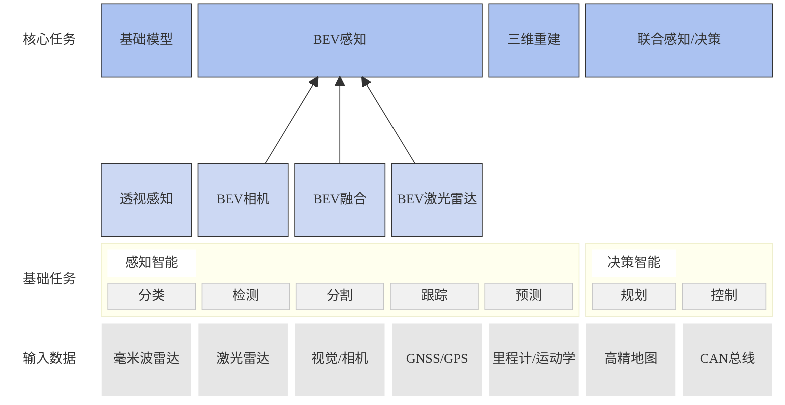

# BEV(Bird’s-Eye-View)

一种鸟瞰视图的传感器数据表示方法

## BEV感知算法的概念    
+ BEV   
  + Bird’s-Eye-View，鸟瞰图（俯视图）   
  + 尺度变化小  
    + 网络对特征一致的目标表达能力更好  
  + 遮挡小  
+ 感知  
  + 一种响应模式，系统对外界的响应    

+ BEV感知 
  + 建立在众多子任务上的一个概念  
  + 包括分类、检测、分割等  
+ BEV感知输入  
  + 
## BEV感知算法的优势    
BEV感知算法的优势在于它能够提供更全面和更准确的周围环境信息，因为它将来自多个传感器的数据融合在一起，并且能够生成一个鸟瞰图视图，使得自动驾驶车辆能够更好地理解其周围环境，从而提高自动驾驶车辆的安全性和可靠性。   
