

# BEV(Bird’s-Eye-View)

一种鸟瞰视图的传感器数据表示方法

## BEV感知算法简介
### BEV感知算法的概念    
#### BEV   
  + Bird’s-Eye-View，鸟瞰图（俯视图）   
  + 尺度变化小  
    + 网络对特征一致的目标表达能力更好  
  + 遮挡小  
#### 感知  
  + 一种响应模式，系统对外界的响应    

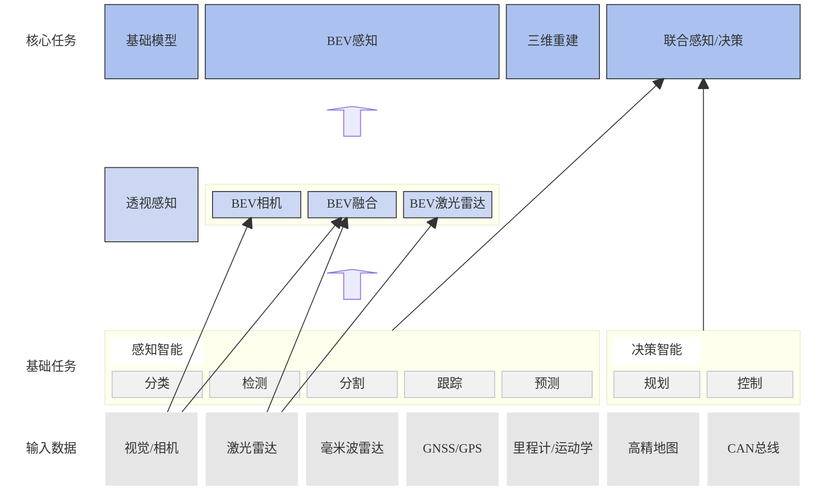

#### BEV感知 
  + 建立在众多子任务上的一个概念  
  + 包括分类、检测、分割等  
#### BEV感知输入  
  + 包括毫米波雷达、激光点云雷达、相机图像等  
  + 根据输入不同有进一步划分不同类型BEV感知算法  
### BEV感知算法的数据形式    
#### 纯图像  
> + 三维世界映射到二维像素表示  
> + 纹理丰富、成本低  
> + 基于图像的任务、基础模型相对成熟，易扩展到BEV  
> *涉及图像的方法使用的基本是图像处理框架中的一些通用网络，如resnet等*
+ BEVFormer  

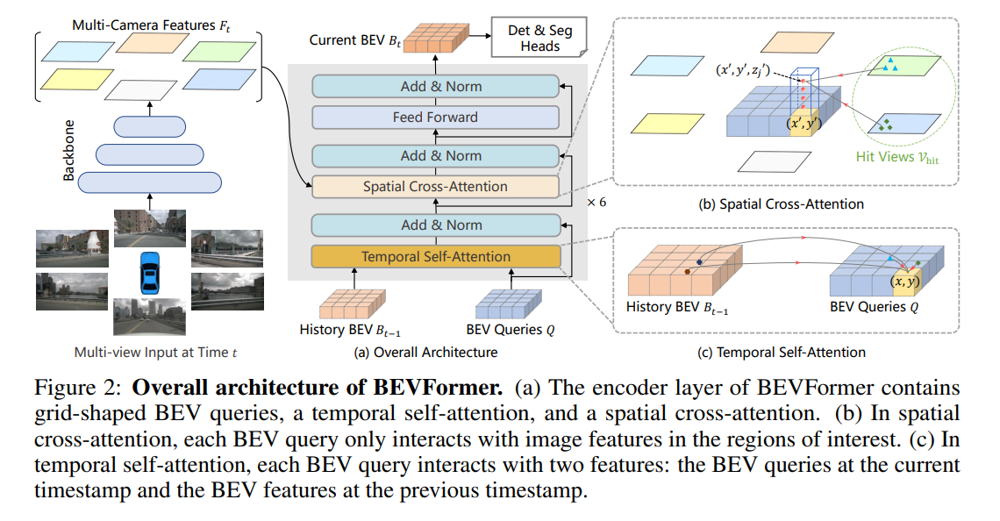

#### 纯点云  
> + 稀疏性  
> + 无序性  
> + 3D表征  
+ 点云特征提取方法——采用一定的聚合方法，将点云数据聚合为特征图  
  + 基于点的（point-based）：聚合关键点和其周围（一个球体空间内）点  
  + 基于体素的（voxel-based）：聚合一定区域内的点  
#### 图像 + 点云  
+ BEVFusion  

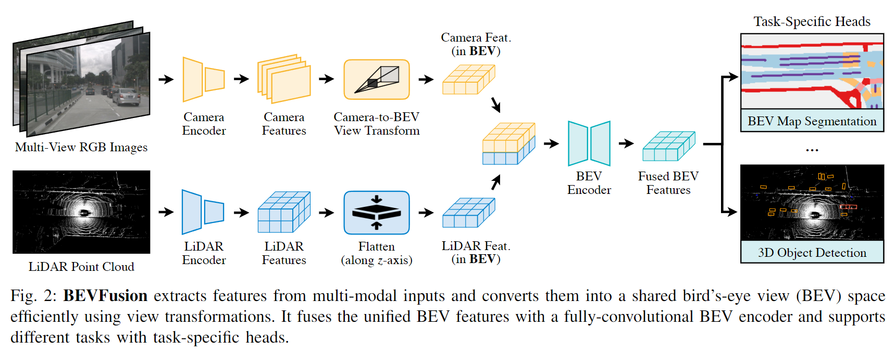

### BEV开源数据集  
#### [KITTI-360](https://www.cvlibs.net/datasets/kitti-360/)  
+ 转换矩阵
  + $$ y=P_{rect}^{(i)}R_{rect}^{(0)}T_{velo}^{cam}x$$  
    + $T$——激光雷达坐标系转换到相机坐标系  
    + $R$——相机畸变矫正矩阵  
    + $P$——相机内参矩阵，3D到2D映射  
  

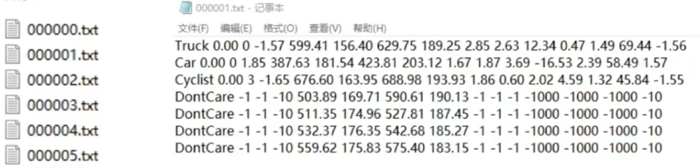
  

+ 标注文件  
  + 按场景标注  
    + 对每个场景进行编号，并有一个同名标注文件  
  + 单个标注文件  
    + 每行表示一个物体  
  + 单行  
    + 目标类型 $class$  
    + 目标被截断程度 $cut\in[0,1]$  
    + 目标被遮挡程度 $obstruction \in\{0,1,2,3\}$，离散值  
    + 目标与相机之间的夹角 $\theta\in[-\pi,\pi]$   
    + 目标边界框左上角和右下角坐标 $(x_{left},y_{left},x_{tight},y_{right})$  
    + 目标的3D尺寸 $(h,w,l)$ ，单位m 
    + 目标在3D场景下的中心点坐标 $(x_{c},y_{c},z_{c})$  ，单位m  
    + 目标在此位置以此类别存在的概率，即置信度得分 $score \in [0,1]$ 
#### [**nuScenes**](https://www.nuscenes.org/)  
> + maps：  栅格化图像和
> + samples：**关键帧**传感器数据，已标注的图像  
> + sweeps：  **中间帧**传感器数据，未标注的图像  
> + v1.0-*：元数据、标注数据  
>   + attribute.json：实例属性  
>   + calibrated_sensors.json：传感器（激光雷达/相机）标定数据  
>   + category.json：对象类别  
>   + ego_pose.json：车辆特定时刻的姿态  
>   + instance.json：一个物体的实例  
>   + log.json：日志信息  
>   + map.json：二值分割掩模地图信息  
>   + sample.json：样例  
>   + sample_annotation.json：3D边界框  
>   + sample_data.json：传感器数据
>   + scene.json：场景数据  
>   + sensor.json：传感器信息  
>   + visibility.json：实例可见性

### BEV感知方法分类  
#### BEV Lidar  
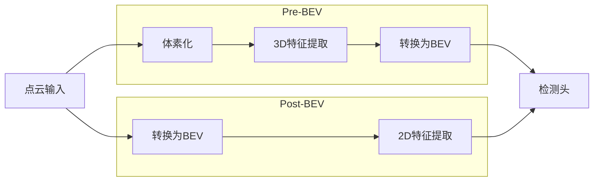

+ Pre-BEV feature extraction  
  先提取特征，再生成BEV表征
  + PV-RCNN  
    + 
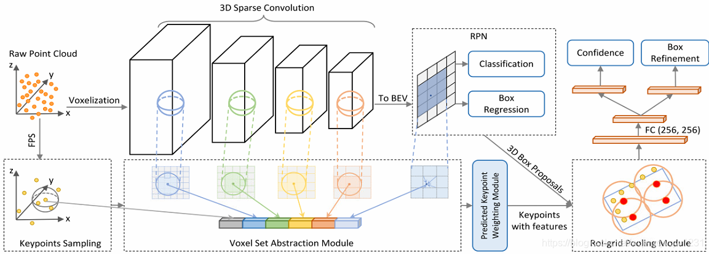
 
    +  point + voxel --> BEV feature map
+ Post-BEV feature extraction  
  先转换到BEV视图，再提取特征
  + PointPillar  

#### BEV Camera  
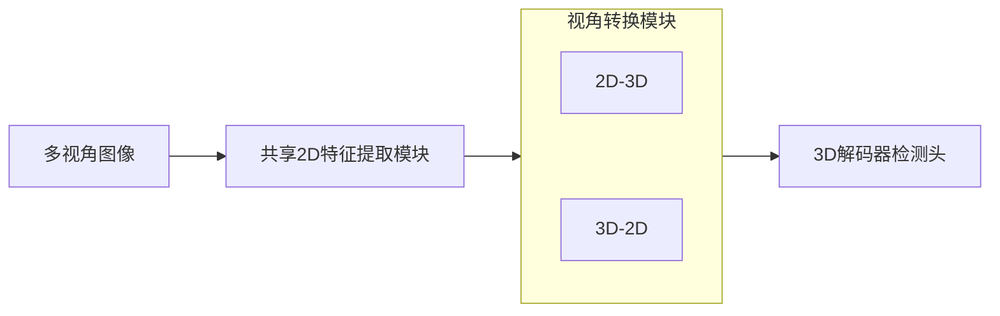

+ BEVFormer  
  + 

#### BEV Fusion  
> **融合是在特征层面的融合**  

+ BEVFusion  
  + 

### BEV感知算法的优劣  

+ BEV感知算法对学术研究的意义  
  + 利于探讨2D到3D的转换过程  
  + 利于视觉图像识别远距离物体或颜色引导的道路  
+ BEV感知算法对工业应用的意义  
  + 降低成本，激光雷达设备成本是视觉设备的10倍  
+ 性能差异  
  + BEV感知算法在感知距离上优于2D感知算法3D检测任务上与点云方案还有一定差距  

### BEV感知算法的应用  
+ Tesla  

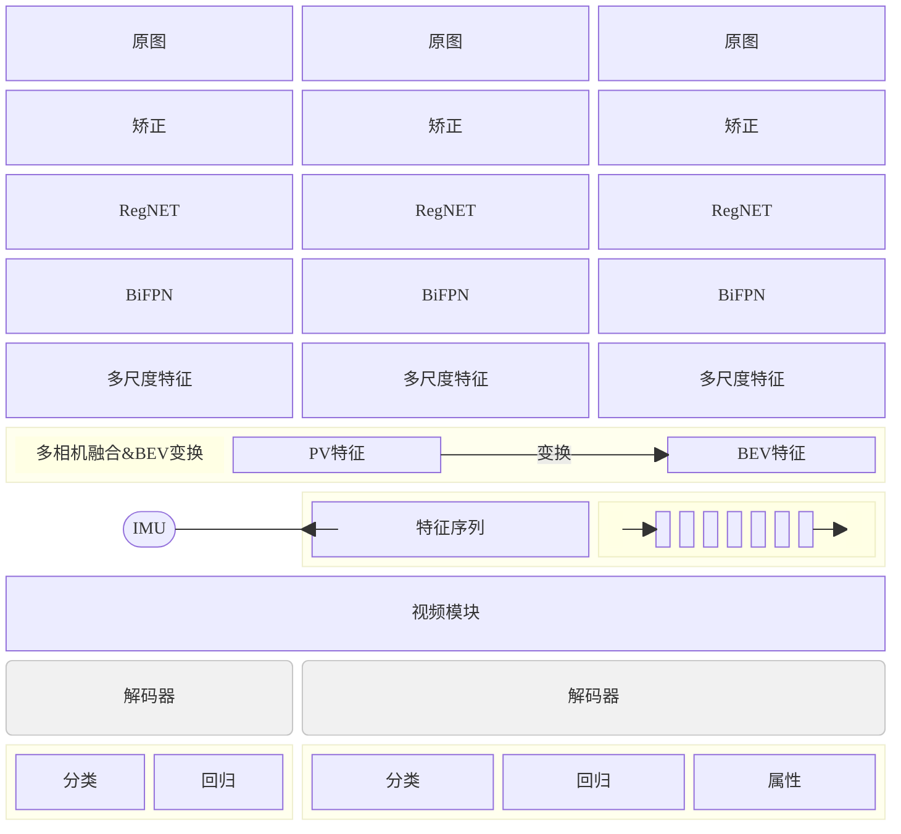

+ Horizon Robotics  

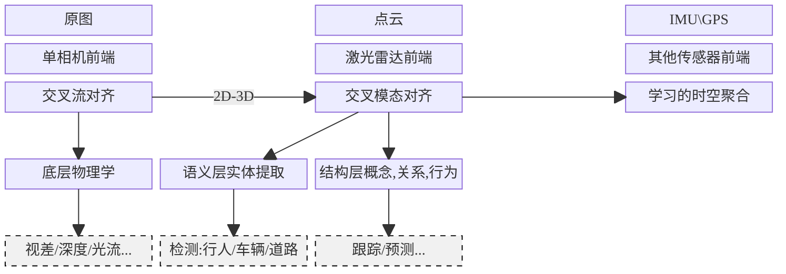

+ HAOMO  

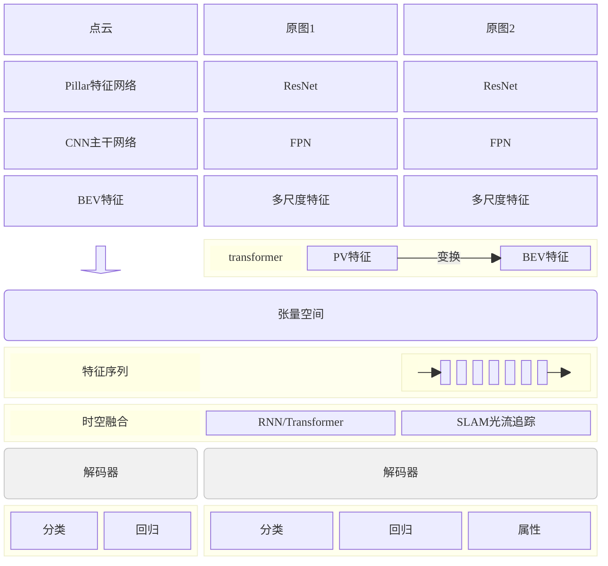

## BEV感知算法基础模块  
### 2D图像处理  

### 3D点云特征处理  

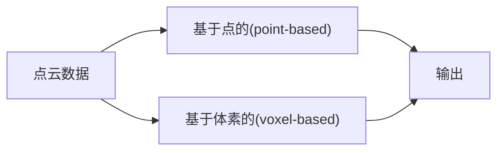
+ 基于点的(point-based)
  + 
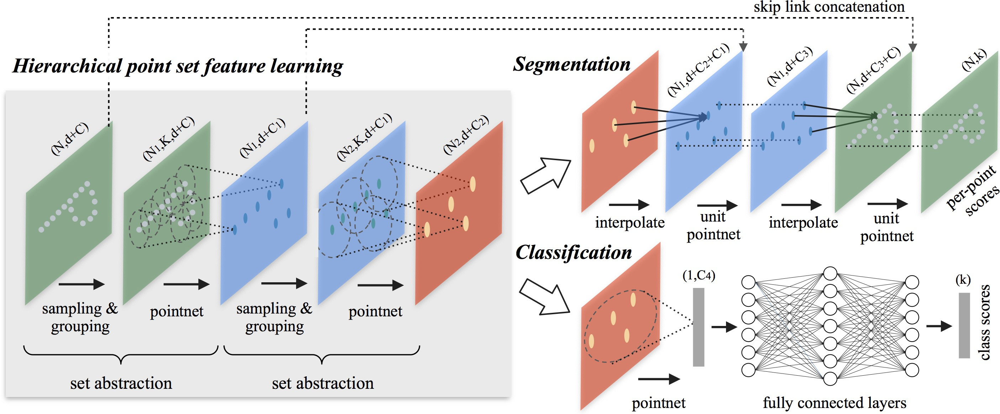

### 2D-3D  

### 3D-2D  

### BEV中的transformer  

## BEV融合感知算法  

## 基于环视camera的BEV感知算法  

## BEV实战  
