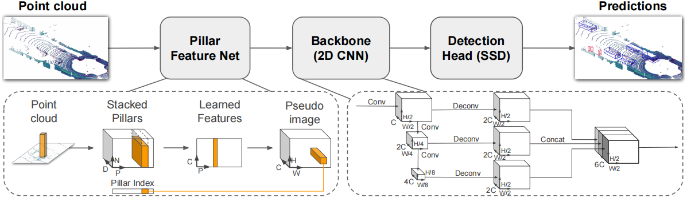

<style>@import url(../../css/auto-number-title.css); </style>

# BEV(Bird’s-Eye-View)

一种鸟瞰视图的传感器数据表示方法

## BEV感知算法简介
### BEV感知算法的概念    
#### BEV   
+ Bird’s-Eye-View，鸟瞰图（俯视图）   
  + 尺度变化小  
    + 网络对特征一致的目标表达能力更好  
  + 遮挡小  
#### 感知  
+ 一种响应模式，系统对外界的响应    
#### BEV感知 
+ 建立在众多子任务上的一个概念  
+ 包括分类、检测、分割等  


+ BEV感知算法通用组成部分  
  + RGB/LiDAR特征提取模块  
  + BEV特征构造模块  
  + 检测头模块  
#### BEV感知输入  
  + 包括毫米波雷达、激光点云雷达、相机图像等  
  + 根据输入不同有进一步划分不同类型BEV感知算法  
### BEV感知算法的数据形式    
+ 纯图像  
   + 三维世界映射到二维像素表示  
   + 纹理丰富、成本低  
   + 基于图像的任务、基础模型相对成熟，易扩展到BEV  
     + *涉及图像的方法使用的基本是图像处理框架中的一些通用网络，如resnet、transformer等*

+ 纯点云  
  + 稀疏性、无序性、3D表征  
  + 点云特征提取方法——采用一定的聚合方法，将点云数据聚合为特征图  
    + 基于点的（point-based）：聚合关键点和其周围（一个球体空间内）点  
    + 基于体素的（voxel-based）：聚合一定区域内的点  
+ 图像 + 点云  


### BEV开源数据集  
#### [KITTI-360](https://www.cvlibs.net/datasets/kitti-360/)  
+ 转换矩阵
  + $$ y=P_{rect}^{(i)}R_{rect}^{(0)}T_{velo}^{cam}x$$  
    + $T$——激光雷达坐标系转换到相机坐标系  
    + $R$——相机畸变矫正矩阵  
    + $P$——相机内参矩阵，3D到2D映射  
  
<p align='center'></p>  

+ 标注文件  
  + 按场景标注  
    + 对每个场景进行编号，并有一个同名标注文件  
  + 单个标注文件  
    + 每行表示一个物体  
  + 单行  
    + 目标类型 $class$  
    + 目标被截断程度 $cut\in[0,1]$  
    + 目标被遮挡程度 $obstruction \in\{0,1,2,3\}$，离散值  
    + 目标与相机之间的夹角 $\theta\in[-\pi,\pi]$   
    + 目标边界框左上角和右下角坐标 $(x_{left},y_{left},x_{tight},y_{right})$  
    + 目标的3D尺寸 $(h,w,l)$ ，单位m 
    + 目标在3D场景下的中心点坐标 $(x_{c},y_{c},z_{c})$  ，单位m  
    + 目标在此位置以此类别存在的概率，即置信度得分 $score \in [0,1]$ 
#### [**<font color=red>nuScenes</font>**](https://www.nuscenes.org/)  
> + maps：  栅格化图像和
> + samples：**关键帧**传感器数据，已标注的图像  
> + sweeps：  **中间帧**传感器数据，未标注的图像  
> + v1.0-*：元数据、标注数据  
>   + attribute.json：实例属性  
>   + calibrated_sensors.json：传感器（激光雷达/相机）标定数据  
>   + category.json：对象类别  
>   + ego_pose.json：车辆特定时刻的姿态  
>   + instance.json：一个物体的实例  
>   + log.json：日志信息  
>   + map.json：二值分割掩模地图信息  
>   + sample.json：样例  
>   + sample_annotation.json：3D边界框  
>   + sample_data.json：传感器数据
>   + scene.json：场景数据  
>   + sensor.json：传感器信息  
>   + visibility.json：实例可见性

### BEV感知方法分类  
#### BEV Lidar  


+ Pre-BEV feature extraction  
  先提取特征，再生成BEV表征
  + PV-RCNN  
    + <p align='center'></p> 
    +  point + voxel --> BEV feature map
+ Post-BEV feature extraction  
  先转换到BEV视图，再提取特征
  + PointPillar  

#### BEV Camera  


#### BEV Fusion  
> **融合是在特征层面的融合**  


### BEV感知算法的优劣  


+ BEV感知算法对学术研究的意义  
  + 利于探讨2D到3D的转换过程  
  + 利于视觉图像识别远距离物体或颜色引导的道路  
+ BEV感知算法对工业应用的意义  
  + 降低成本，激光雷达设备成本是视觉设备的10倍  
+ 性能差异  
  + BEV感知算法在感知距离上优于2D感知算法3D检测任务上与点云方案还有一定差距  

### BEV感知算法的应用  
+ Tesla  


+ Horizon Robotics  


+ HAOMO  


## BEV感知算法基础模块  
### 2D图像处理  


### 3D点云特征处理  


+ 基于点的(point-based)  
> 直接对点云数据进行特征提取，再进一步提取点的稀疏表示  
  + <p align=center><br><a href="https://github.com/charlesq34/pointnet2" target="_blank" title="https://github.com/charlesq34/pointnet2">（例）Point Net++ </a></p>

+ 基于体素的(voxel-based)  
> 先将点云数据划分为体素，通过三维卷积对体素进行特征提取，再进一步提取体素的稀疏表示  
  + <p align=center><br><a href="https://github.com/steph1793/Voxelnet" target="_blank" title="https://github.com/steph1793/Voxelnet">（例）VoxelNet</a></p>

### 2D-3D  
> 由环视图像，构建BEV视角特征  


$$
Z_{c}\left[\begin{matrix}x\\y\\1\end{matrix}\right]=\left[\begin{matrix}f&0&0&0\\0&f&0&0\\0&0&1&0\end{matrix}\right]\left[\begin{matrix}X_{C}\\Y_{C}\\Z_{C}\\1\end{matrix}\right]
$$

+ LSS(Lift, Splat,and Shoot)  
  + <p align=center><br><a href="https://github.com/nv-tlabs/lift-splat-shoot" target="_blank" title="https://github.com/nv-tlabs/lift-splat-shoot">（例）LSS</a></p>  
  + lift模块做**深度分布**  
  + splat做特征映射  
  + shoot做结果预测  
  + **离散深度估计**  
    + 连续深度预测任务转换为分类任务  
+ Pseudo Lidar  
  + <p align=center><br><a href="https://github.com/mileyan/pseudo_lidar" target="_blank" title="https://github.com/mileyan/pseudo_lidar">（例）Pseudo Lidar</a></p>  
  + **连续深度估计**——伪点云  

### 3D-2D  
> 由3D到2D构建BEV空间  

#### 显式映射 
> 预先知道3D参考点,利用3D对象查询进行2D图像特征查询  
+ DETR3D 
  + <p align=center><br><a href="https://github.com/WangYueFt/detr3d" target="_blank" title="https://github.com/WangYueFt/detr3d">（例）DETR3D </a></p>  
+ FUTR3D(多模态)  
    > 利用不同的骨干网络提取多模态特征，再根据查询点聚合多模态特征  
    + <p align=center><br><a href="https://github.com/Tsinghua-MARS-Lab/futr3d" target="_blank" title="https://github.com/Tsinghua-MARS-Lab/futr3d">（例）FUTR3D </a></p>  

#### 隐式映射
> 不知道3D参考点，不需要显式的2D-3D映射关系  
+ PETR3D  
  + <p align=center><br><a href="https://github.com/megvii-research/PETR" target="_blank" title="https://github.com/megvii-research/PETR">（例）PETR3D </a></p>
### BEV中的transformer  

[各种注意力机制](https://www.cnblogs.com/wxkang/p/17133460.html)
> + 通道注意力  
>   + <p align=center><br>channel attention</p>
> + 空间注意力   
>   + <p align=center><br>spatial attention</p>  
> + 混合注意力  
>   + <p align=center><br>cbam</p>  
>   + <p align=center><br>cam</p>  
>   + <p align=center><br>cam</p>    
> + 自注意力  
>   + <p align=center><br>self-attention</p>  
 #### 自注意力机制  
 > 计算给定序列的各位置之间的影响力大小  
 > 查询向量Q、键向量K、值向量V，计算相似度  
 + ViT(Vision Transformer)——图像分类  
   + 将图像序列化表示，一张图片无重叠切分成固定尺寸的Patch  
   + Position Embedding，将Patch的相对位置信息编码到向量中  
+ SwimTransformer——图像分类   
  + ViT在全图进行划分Patch序列化并计算注意力，但常常目标在图像中占比并不大  
  + 先划分Window，再在Window内划分Patch进行序列化，计算注意力  
+ **DETR——目标检测**  
  + 将目标检测问题转化为一个直接回归问题  
  + <p align=center><br>detr</p>  
+ RT-DETR  
  + 基于DETR（无NMS框架），同时引入基于CORV的主干网络和高效的混合编码器以获得实时速度  
  + <p align=center><br>rt-detr</p>   
+ **DETR3D**  
  + 基于DETR，将BEV视角下的3D目标检测问题转化为一个直接回归问题  
  + <p align=center><br><a href="https://github.com/WangYueFt/detr3d" target="_blank" title="https://github.com/WangYueFt/detr3d">（例）DETR3D </a></p> 
## BEV融合感知算法  
> Lidar + Camera  
> 模态信息的互补  
### 融合方案  
+ 前融合(数据级融合)  
  + 通过空间对其直接融合不同模态的原始传感器数据  
+ 深度融合(特征级融合)  
  + 通过级联或元素相乘在特征空间中跨模态融合  
+ 后融合(目标级融合)  
  + 将各模态模型的预测结果进行融合。作出最终决策  

+ <p align=center><br>fusion_methods </p> 

```mermaid
graph LR

```

### 基础算法  
#### [BEV-SAN](https://github.com/litwellchi/BEV-SAN)  
+ <p align=center><br><a href="https://github.com/litwellchi/BEV-SAN" target="_blank" title="https://github.com/litwellchi/BEV-SAN">BEV-SAN </a></p>
+ 主要针对BEV特征构造模块的工作  
  + 已有算法专注于高度维度展平BEV空间，导致**高度维度上的信息丢失**  
  + 核心设计是**切片注意力网络(Slice Attention Network)**  
+ 选择特征的高度范围  
  + 提出LIDAR-guided sampling for slice attention  
  + 根据点云统计结果作为局部特征高度划分的依据  
+ 融合多级特征  
  + 提出Fusion Transformer，同时融合全局和局部特征  

#### BEVFusion  
+ BEV Fusion 阿里  
  + <p align=center><br><a href="https://github.com/ADLab-AutoDrive/BEVFusion" target="_blank" title="https://github.com/ADLab-AutoDrive/BEVFusion">bevfusion_ali</a></p>   
  + 相机支路  
    > 输入：多视角图像  
    > 步骤 1：2D Backbone 提取基础图像特征  
    > 步骤 2：FPN+ADP，多尺度特征融合  
    > 步骤 3：2D➡3D 特征转换模块  
    > 步骤 4：3D➡BEV 特征编码模块  
    > 输出：Camera BEV Features  
    + FPN+ADP  
      + > 输入：基础图像特征   
        > 步骤 1：每层特征使用 ADP 模块  
        > 步骤 2：ADP 模块包括上采样、池化、卷积  
        > 步骤 3：多层特征融合  
        > 输出：多尺度融合特征  
      + <p align=center><br>fpn+adp模块</p>  
    + 2D➡3D 特征转换  
      + > 输入：多尺度融合特征  
        > 步骤 1：深度分布估计  
        > 步骤 2：2D 到 3D 投影计算  
        > 输出：3D 伪体素特征  
      + <p align=center><br>2D➡3D特征转换</p>  
  + 点云支路  
    + 点云特征提取方案有基于点的、基于体素的，包括 PointPillars、CenterPoint、TransFusion等  
    + <p align=center><br>PointPillars网络结构</p> 
    + Pillar 是一个用于聚合特征的柱状空间，一个柱子包含 `N` 个点，每个点的特征是 `D` 维，，一个 3D 场景有 `P` 个柱子，则整个 3D 场景用柱子特征来表示就是 $P \times D \times N$   
      + PointPillars 中默认 `D` 是一个 9 维量 
        + $(x,y,z)$ 是点的坐标  
        + $(x_{c},y_{c},z_{c})$ 是点所在 pillar 的中心点坐标  
        + $(x_{p},y_{p})$ 是点距离柱子中心点的偏移量  
          + > :question: **为什么 PointPillars 不考虑 `z` 方向的偏移量**   
            > *PointPillars 主要用于处理从地面车辆（如自动驾驶汽车）收集的点云数据。在这类应用中，z 方向（垂直于地面）的变化通常不如 x 和 y 方向（水平方向）那么显著或重要。因此，z 方向的偏移可能被认为对模型的性能影响不大，而忽略它可以简化模型并减少计算需求。另一个可能的原因是在垂直方向上，点云数据可能展示出不同的分布特性，使得直接使用不如其他维度那么有效*   
        + 反射值 $r$ 表示点云中每个点的反射强度,反映了对象表面反射激光脉冲的能力  
  + 融合  
    + <p align=center><br>融合模块</p>  
    + > 输入：点云和图像 BEV 特征  
      > 步骤 1：按通道维度级联点云和图像 BEV 特征，再通过卷积网络提取级联后的特征  
      > 步骤 2：通过全局平均池化和卷积预测，实现对级联特征的自适应挑选，类似于通道注意力  
      > 输出：融合后的特征  

+ BEV Fusion MIT
  + <p align=center><br><a href="https://github.com/mit-han-lab/bevfusion" target="_blank" title="https://github.com/mit-han-lab/bevfusion">bevfusion_mit</a></p>    
  + 工作思路是一致的，都是通过分开提取特征再融合的方式得到融合后的 BEV 特征，其中 Camera Stream 和 LiDAR Stream 的处理一致  
  + 额外引入了分割任务  

## 基于环视camera的BEV感知算法  
> Only Camera  
> 相机具有最密集的信息  
> 相机成本最低  

### 基础算法  

#### **DETR3D** 
+ DETR  
  + 
+ DETR3D基于DETR，将BEV视角下的3D目标检测问题转化为一个直接回归问题  
  + <p align=center><br><a href="https://github.com/WangYueFt/detr3d" target="_blank" title="https://github.com/WangYueFt/detr3d">DETR3D</a></p>  
+ 图像特征提取模块——resnet+fpn    
  + 输入：多视角相机图像，相机内外参数  
  + 步骤1：2D骨干网络提取图像特征  
  + 步骤2：FPN，多尺度特征融合  
  + 输出：图像特征

+ 特征转换模块  
  + 输入：多视角图像特征、Object Queries  
    + Object Queries是一系列指定数目的随机初始化的查询向量，用于查询空间中哪里有物体  
    + Queries是 transformer结构，预测生成一系列Reference Points(参考点)  
  + 步骤1：提取参考点  
  + 步骤2：点--->图像像素  
  + 步骤3：图像特征提取  
  + 步骤4：2D特征优化3D表征  
  + 输出：Object Feature  
+ 损失函数  
  + 二分图匹配  
    + 图像中物体真值集合用空集补全至与预测集合数量一致  
    + 两集合内目标物体一一对应计算损失  

#### BEVFormer  
+ <p align='center'></p>

+ 视角转换模块  
  + 输入：多视角图像特征、历史BEV特征(时序层面特征)、BEV query  
  + 步骤1：**时序自注意力**，利用BEV query融合多视角图像特征和历史BEV特征   
    + 引入Deformable Attention，引入注意力偏移量，使注意力机制更加灵活，解决以下两个问题  
      + **引入前一时刻的BEV特征**  
      + **不同帧中车的偏移量不同**  
    + 多视角图像特征利用BEV query查询对应的历史BEV特征  
    + BEV query上做self-attention  
  + 步骤2：空间交叉注意力  
    + 选择所需要的特征  
      + 同样引入bev query和Deformable Attention  
    + 建模高度信息  
      + 设置一系列不同高度anchor  
  + 输出：当前BEV特征  

+ BEVFormer v2  
  +   
  + 添加一个近端检测头perspective 3d head，增强原有的远端预测头对于主干网络参数的更新  
  + 两阶段检测器
    + 将第一阶段的初步检测结果与第二阶段中的随机初始化的object query进行混合得到新的object query  
#### BEVDet  
+   
+ 图像视图编码器  
  + 输入：多视角图像  
  + 步骤1：2D主干网络(ResNet+Swin-Transformer)提取特征  
  + 步骤2：多尺度融合特征(FPN)  
  + 输出：多视角图像特征  
+ 视角转换模块  
  + 输入：所视角图像特征  
  + 步骤1：深度分布预测   
  + 步骤2：2D-->3D特征映射  
  + 输出：3D视锥特征(伪体素)  
+ BEV编码器  
  + 输入：3D视锥特征  
  + 步骤1：池化  
  + 步骤2：多尺度融合  
  + BEV空间特征  
+ 改进策略  
  + 为了防止模型的过拟合，在BEV的空间中进行额外的数据增强操作  
    + 图像输入是BEV数据量的N(相机数量)倍  
  + 对NMS进行升级，以提高在三维场景的适应性  
    +   
#### BEVDet4D  
+   
+ 
# BEV实战  
