<style>@import url(../../css/auto-number-title.css); </style>

# Pathing Planning(路径规划)

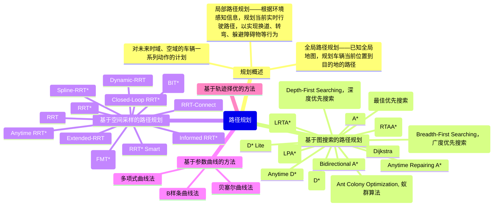

+ 基于图搜索的路径规划
  + BFS(Breadth-First Searching，广度优先搜索)  
  + DFS(Depth-First Searching，深度优先搜索)  
  + Best-First Searching(最佳优先搜索)  
  + **Dijkstra**  
  + **ACO(Ant Colony Optimization, 蚁群算法)**  
  + **A\***  
  + Bidirectional A\*  
  + Anytime Repairing A\*  
  + Learning Real-time A\* (LRTA*)  
  + Real-time Adaptive A\* (RTAA*)  
  + Lifelong Planning A\* (LPA*)  
  + Dynamic A\* (D\*)  
  + D\* Lite  
  + Anytime D\*  
+ 基于空间采样的路径规划  
  + RRT  
  + RRT-Connect  
  + Extended-RRT  
  + Dynamic-RRT  
  + RRT\*  
  + Informed RRT\*  
  + RRT* Smart
  + Anytime RRT\*  
  + Closed-Loop RRT\*  
  + Spline-RRT\*  
  + Fast Marching Trees (FMT\*)  
  + Batch Informed Trees (BIT\*)  
+ 基于参数曲线的路径规划  
  + 多项式曲线法    
  + 贝塞尔曲线法  
  + B样条曲线  
+ 基于数值最优化的路径规划  
+ 基于轨迹择优的路径规划  

## 基于图搜索的路径规划

通过搜索图形结构来找到最短或最优的路径，其中 A\* 是最为常用和经典的算法之一

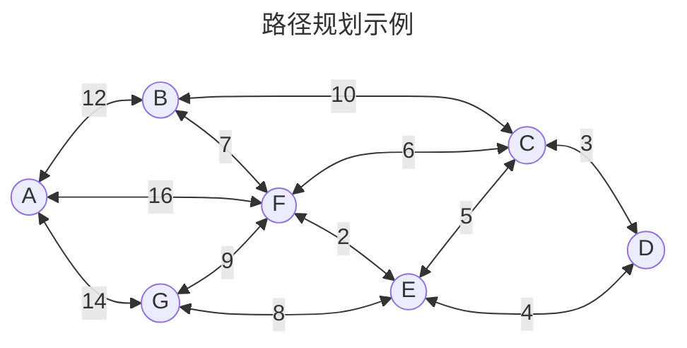

### BFS

+ 优点：可找到最短路径；适用于无权图
+ 缺点：时间复杂度高；空间复杂度高

### DFS

<p align='center'>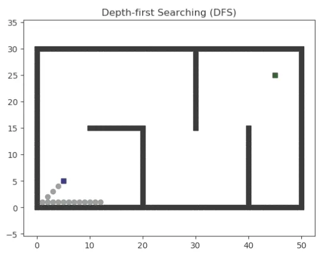</p>
+ 优点：空间复杂度低
+ 缺点：可能会陷入死循环；不一定能找到最短路径

### Best-First Searching

+ 优点：速度快；可以处理启发式信息
+ 缺点：可能会陷入局部最优解

### <font color=Red>**Dijkstra**</font>

一种用于求解图中单源最短路径问题的经典算法，可以用来找到从一个顶点到其他所有顶点的最短路径。可以应用于有向图或无向图。该算法通过不断更新起点到各个顶点的最短路径来找到最终的最短路径。Dijkstra算法的时间复杂度为 $O(V^2)$ ，其中`V`为顶点数，但可以通过优先队列实现最小堆来优化时间复杂度。

+ 算法思想
  + 设`G=(V,E)`是一个带权有向图，把图中节点集合分为两组，<font color=Red>第一组为已求出最短路径的节点集合</font>（用`S`表示，初始时`S`中只有一个源点，以后每求得一条最短路径，就将该节点加入到`S`中，知道全部节点都加入`S`）
  + <font color=Red>第二组为其余未确定最短路径的节点集合</font>（用U表示），按最短路径递增次序依次把第二组节点加入S中
    + 初始时，`S`只包含起点`s`，`U`包含除`s`以外的其他节点，`U`中节点`v`和`s`不相邻则距离为 $\infty$
    + 从U中选出“距离最短的节点`k`”，将`k`移入`S`中，并从`U`中移除`k`
    + 更新U中各节点到起点`s`的距离，利用`k`更新其他节点的距离（`(s,v)`可能大于`(s,k)+(k,v)`）
    + 重复步骤2、3，直到遍历所有节点
+ 代码实现

```python
import numpy as np

"""图定义
A-B-C-D-E-F-G
1-2-3-4-5-6-7
"""

nodes_dict = {
    1: np.asarray([[2, 6, 7], [12, 16, 14]], np.float32).T,
    2: np.asarray([[1, 3, 6], [12, 10, 7]], np.float32).T,
    3: np.asarray([[2, 4, 5, 6], [10, 3, 5, 6]], np.float32).T,
    4: np.asarray([[3, 5], [3, 4]], np.float32).T,
    5: np.asarray([[3, 4, 6, 7], [5, 4, 2, 8]], np.float32).T,
    6: np.asarray([[1, 2, 3, 5, 7], [16, 7, 6, 2, 9]], np.float32).T,
    7: np.asarray([[1, 5, 6], [14, 8, 9]], np.float32).T
}

"""算法初始化
S/U的第一列表示节点编号
对于`S`，第二列表示从源节点到本节点已求出的最小距离，不再变更
对于`U`，第二列表示从源节点到本节点暂得的最小距离，可能变更
"""
S = np.asarray([[4, 0]], np.float32)
U = np.zeros([6, 2], np.float32)
U[:, 0] = [1, 2, 3, 5, 6, 7]
U[:, 1] = ['inf', 'inf', 3, 4, 'inf', 'inf']

# 最优路径及暂时最优路径的初始化
path_option = {4: [4]}
path_temp = {3: [4, 3], 4: [4], 5: [4, 5]}

while U.size != 0:
    dist_min = np.min(U[:, 1])
    row_idx = np.argmin(U[:, 1])
    node_min = U[row_idx, 0]
    S = np.concat((S, [[node_min, dist_min]]))
    U = np.delete(U, row_idx, 0)
    
    # 将最小距离的节点添加到最优路径集合
    path_option[node_min] = path_temp[node_min]
    
    # 遍历最小距离节点的邻节点，判断是否在U集合中更新邻节点的距离
    nearby_nodes = nodes_dict[node_min][:, 0]
    for n in range(len(nearby_nodes)):
        node_temp = nearby_nodes[n]  # 节点
        idx_temp = np.where(U[:, 0] == node_temp)  # 节点在U索引
        if node_temp in U[:, 0]:  # 判断节点是否在U集合中
            if dist_min + nodes_dict[node_min][:, 1][n] < U[idx_temp, 1]:
                U[idx_temp, 1] = dist_min + nodes_dict[node_min][:, 1][n]
                
                # 更新暂时最优路径
                path_temp[node_temp] = path_option[node_min] + [node_temp]

print(np.asarray(S, dtype = np.int8))
print(np.asarray(path_option[1], dtype = np.int8))
```

<p align='center'>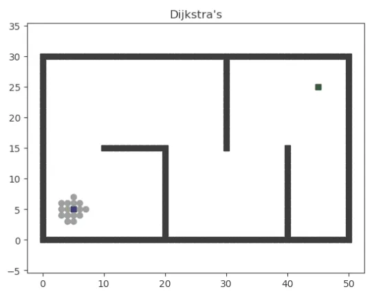</p>

+ 优点：可以找到最短路径；适用于有权图
+ 缺点：时间复杂度高；不能处理负权边

### ACO

模拟蚂蚁的觅食行为，每只蚂蚁在经过的路径释放信息素，蚂蚁倾向于走最短路径，信息素浓度表征路径的远近
较短路径上蚂蚁的往返时间比较短，单位时间内经过该路径的蚂蚁多，所以信息素的积累速度比较长路径快
其他路径上的信息素会随着时间蒸发，最终所有的蚂蚁都在最优路径上行进

+ 数学描述<br>
  设蚁群中蚂蚁数量为 $m$ ，城市数量为 $n$ ，城市i与城市j之间的距离为 $d_{ij}(i,j=1,2,\ldots,n)$ ， $t$ 时刻城市 $i$ 与城市 $j$ 链接路径上的信息素浓度为 $\tau_{ij}(t),\tau_{ij}(0)=0$ 。
  蚂蚁 $k$ 根据各城市连接道路上的信息素浓度决定下一个访问城市，设 $P_{ij}^{k}(t)$ 表示 $t$ 时刻蚂蚁 $k$ 从城市 $i$ 转移到城市 $j$ 的概率，其计算公式如下:
  + 对于每只蚂蚁 $k$ ，路径记忆向量 $R^k$ 按照访问顺序记录了所有k已经经过的城市序号
    + 设蚂蚁 $k$ 当前所在城市为 $i$ ，则其选择城市 $j$ 作为下一个访问对象的概率如上式
    + $J_k(i)$ 表示从城市 $i$ 可以直接到达的、且又不在蚂蚁访问过的城市序列中的城市集合
    + $\tau_{ij}$ 表示边 $(i,j)$ 上的信息素量
    + $\eta_{ij}$ 是一个启发式信息，通常为 $\eta_{ij}=\frac{1}{d_{ij}}$ ,表示蚂蚁从城市i转移到城市j的期望程度
  + 长度越短、信息素浓度越大的路径被蚂蚁选择的概率越大
    + $\alpha$ 和 $\beta$ 是两个预先设置的参数，用来控制启发式信息与信息素浓度作用的权重关系
    + 当 $\alpha=0$ 时，算法演变成传统的随机贪心算法，最邻近城市被选中的概率最大
    + 当 $\beta=0$ 时，蚂蚁完全只根据信息素浓度确定路径，算法将快速收敛，这样构建出的最优路径往往与实际目标有着较大的差异，算法的性能比较糟糕

$$
P_{ij}^{k}(t)=
\begin{cases}
\frac{\left[\tau_{ij}(t)\right]^{\alpha}\left[\eta_{ij} (t)\right]^{\beta}}{\sum_{u\in J_{k} (i)}\left[\tau(i,u)\right]^{\alpha}\left[\eta(i,u)\right]^{\beta}}& j\in J_{k}(i)\\
0& j\notin J_{k}(i)
\end{cases}  
$$

+ 信息素更新
    1. 在算法初始化时，问题空间中所有的边上的信息素都被初始化为 $t_0$
    2. 算法迭代每一轮，问题空间中的所有路径上的信息素都会发生蒸发，我们为所有边上的信息素乘上一个小于1的常数。信息素蒸发是自然界本身固有的特征，在算法中能够帮助避免信息素的无限积累，使得算法可以快速丢弃之前构建过的较差的路径
    3. 蚂蚁根据自己构建的路径长度在它们本轮经过的边上释放信息素
        + 蚂蚁构建的路径越短、释放的信息素就越多
        + 一条边被蚂蚁爬过的次数越多、它所获得的信息素也越多
    4. 迭代（2），直至算法终止

$$
\tau_{ij}(t+1)=(1-\rho)\cdot \tau_{ij}(t)+\sum_{k=1}^{m} \Delta \tau_{ij}^{k}
$$

+ 不同模型的信息素释放浓度计算
  + ant cycle system模型
    + m是蚂蚁个数
    + $\rho\in(0,1]$ 是信息素的蒸发率
    + $\Delta\tau^{k}$ 是第`k`只蚂蚁在它经过的边上释放的信息素量
    + $C^k$ 表示路径长度，它是 $R^k$ 中所有边的长度和。

$$
\Delta \tau_{ij}^{k}=
\begin{cases}
\frac{Q}{C^{k}}, & (i,j)\in R^k \\
0,& oherwise
\end{cases}
$$

### 动态规划算法

把多阶段决策问题转换为一系列单阶段最优化问题
<p align='center'>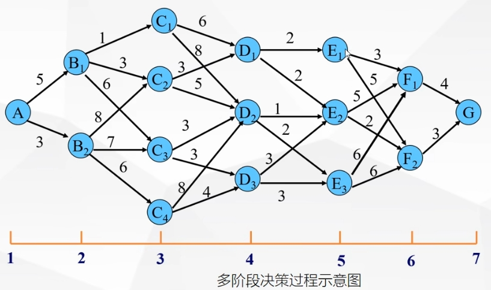</p>

+ 逆向寻优，正向求解
+ DP算法本质由三层循环构成
  + 第一层遍历每个阶段
  + 第二层遍历第i个阶段的每个状态
  + 第三层循环遍历第i+1阶段的每个状态

<p align='center'>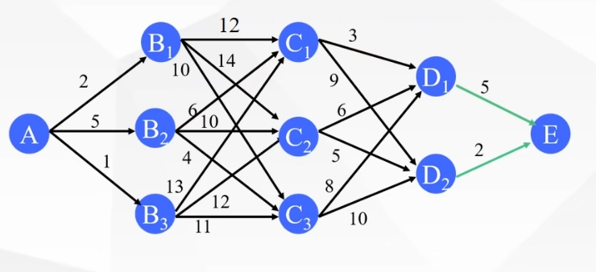</p>


### <font color=Red>**A\***</font>

A\*算法是一种启发式搜索算法，它结合了Dijkstra算法和贪婪最佳优先搜索算法的优点。A\*算法通过估计从当前节点到目标节点的代价来动态调整搜索方向，从而更快地找到最佳路径。
<p align='center'>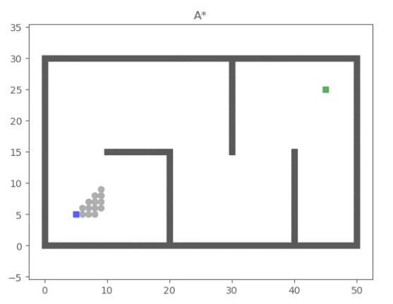</p>

+ 优点：速度快；可以处理启发式信息；可以找到最短路径
+ 缺点：可能会陷入局部最优解

### Bidirectional A\*

+ 优点：速度快；可以找到最短路径
+ 缺点：需要存储两个搜索树；可能会出现问题，例如搜索空间过大或搜索树生长过慢

### Anytime Repairing A\*

<p align='center'>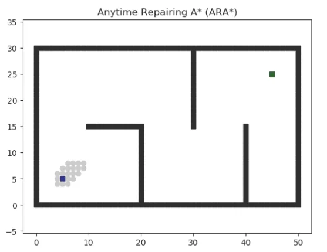</p>

+ 优点：可以在任何时候停止搜索并返回最佳路径；可以处理启发式信息
+ 缺点：可能会陷入局部最优解

### Learning Real-time A\* (LRTA*，实时学习 A\*)

+ 优点：可以处理动态环境；可以处理启发式信息。
+ 缺点：需要进行实时计算，可能会导致性能问题

### Real-time Adaptive A\* (RTAA\*，实时自适应 A\*)

+ 优点：可以处理动态环境；可以处理启发式信息
+ 缺点：需要进行实时计算，可能会导致性能问题

### Lifelong Planning A\* (LPA\*，终身规划 A\*)

+ 优点：可以在不同的时间段进行搜索；可以处理启发式信息
+ 缺点：需要存储大量的搜索树

### Dynamic A\* (D\*，动态 A\*)

+ 优点：可以处理动态环境；可以处理启发式信息
+ 缺点：需要存储大量的搜索树。

### D* Lite

+ 优点：可以处理动态环境；可以处理启发式信息；空间复杂度低
+ 缺点：可能会陷入局部最优解。

### Anytime D*

+ 优点：可以在任何时候停止搜索并返回最佳路径；可以处理动态环境；可以处理启发式信息
+ 缺点：可能会陷入局部最优解。

## 基于空间采样的路径规划

适用于复杂环境中的路径规划，如机器人导航、无人驾驶和物流配送等领域

### <font color=Red>RRT(Rapidly-Exploring Random Trees, 快速探索随机树)</font>

RRT（Rapidly-exploring Random Tree）算法是一种适用于高维空间的路径规划算法，它通过随机采样和不断扩展树形结构来搜索路径
  
<p align='center'>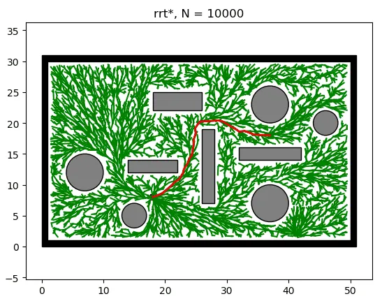</p>

+ 优点：适用于高维空间；能够有效处理复杂环境；运算速度较快
+ 缺点：无法保证找到最优解；生成的路径可能不是最短路径;算法的运算效率不高，随机树搜索漫无目的

<p align='center'>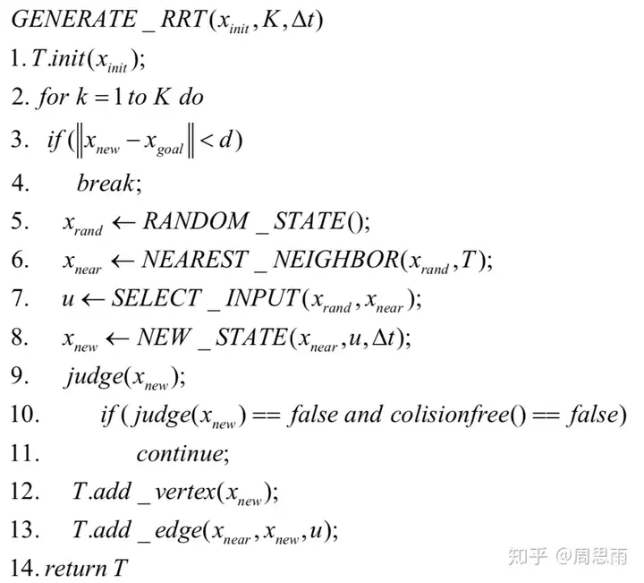</p>

+ RANDOM_STATE()函数在设定的环境内部产生随机点
+ NEAREST_NEIGHBOR()函数遍历随机树，找出距离随机点最近的节点
+ SELECT_INPUT()函数按照已设定好的值扩展随机树
+ NEW_STATE()函数生成
+ judge($x_{new}$)函数判断新生成的节点是否满足非完整约束
+ T.add_vertex()插入$x_{new}$
+ T .add _ edge()为$x_{near}$到$x_{new}$之间加上一条边

### Goal-Biased RRT(基于目标的RRT算法)

  为了高算法的效率，希望随机树的搜索并不是完全漫无目的的，希望随机树尽可能向着目标方向搜索，以加快搜索速度。
具体的操作方法是：人为的引导随机点的生成。在产生随机点$x_{rand}$时，以一定的概率选取目标点作为循环中的$x_{rand}$，即$x_{rand}=x_{goal}$。
$x_{rand}$在随机树扩展中相当于给定一个扩展的方向，以一定的概率将目标点作为$x_{rand}$，就等价于驱使随机树向着目标方向扩展，将图1展示的算法流程中RANDOM_STATE()函数改写为如下形式：
<p align='center'>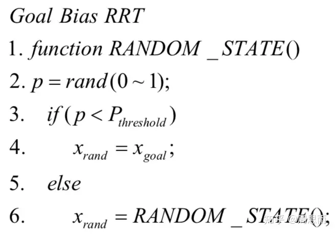</p>

### RRT-Connect

+ 优点：可以保证找到可行路径；适用于多机器人路径规划问题
+ 缺点：路径质量可能较差；可能收敛速度较慢。

### Extended-RRT

+ 优点：能够处理非完整动力学系统；适用于多机器人协同规划
+ 缺点：路径质量可能较差；运算速度较慢

### Dynamic-RRT

<p align='center'>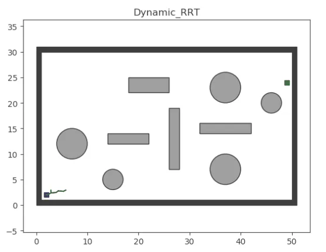</p>

+ 优点：能够处理动态环境中的路径规划问题；适用于移动机器人和无人机等领域
+ 缺点：运算速度较慢；路径质量可能较差

```python
# --------Visualization specialized for dynamic RRT
    def visualization(self):
        if self.ind % 100 == 0 or self.done:
            V = np.array(self.V)
            Path = np.array(self.Path)
            start = self.env.start
            goal = self.env.goal
            # edges = []
            # for i in self.Parent:
            #     edges.append([i, self.Parent[i]])
            edges = np.array([list(i) for i in self.Edge])
            ax = plt.subplot(111, projection='3d')
            # ax.view_init(elev=0.+ 0.03*initparams.ind/(2*np.pi), azim=90 + 0.03*initparams.ind/(2*np.pi))
            # ax.view_init(elev=0., azim=90.)
            ax.view_init(elev=90., azim=0.)
            ax.clear()
            # drawing objects
            draw_Spheres(ax, self.env.balls)
            draw_block_list(ax, self.env.blocks)
            if self.env.OBB is not None:
                draw_obb(ax, self.env.OBB)
            draw_block_list(ax, np.array([self.env.boundary]), alpha=0)
            draw_line(ax, edges, visibility=0.75, color='g')
            draw_line(ax, Path, color='r')
            # if len(V) > 0:
            #     ax.scatter3D(V[:, 0], V[:, 1], V[:, 2], s=2, color='g', )
            ax.plot(start[0:1], start[1:2], start[2:], 'go', markersize=7, markeredgecolor='k')
            ax.plot(goal[0:1], goal[1:2], goal[2:], 'ro', markersize=7, markeredgecolor='k')
            # adjust the aspect ratio
            set_axes_equal(ax)
            make_transparent(ax)
            # plt.xlabel('s')
            # plt.ylabel('y')
            ax.set_axis_off()
            plt.pause(0.0001)
if __name__ == '__main__':
    rrt = dynamic_rrt_3D()
    rrt.Main()
```

### RRT*(Rapidly-Exploring Random Trees Star, 快速探索随机树星)

+ 优点：能够找到最优路径；路径质量较高
+ 缺点：运算速度较慢；可能需要大量的存储空间

### Informed RRT*

+ 优点：结合了启发式信息，能够加速搜索过程；能够找到近似最优解
+ 缺点：运算速度较慢；路径质量可能较差

### RRT* Smart

+ 优点：通过智能采样策略提高搜索效率；能够找到最优路径
+ 缺点：运算速度较慢；路径质量可能较差

 ```python
class Node:
    def __init__(self, n):
        self.x = n[0]
        self.y = n[1]
        self.parent = None

class RrtStarSmart:
    def __init__(self, x_start, x_goal, step_len,
                 goal_sample_rate, search_radius, iter_max):
        self.x_start = Node(x_start)
        self.x_goal = Node(x_goal)
        self.step_len = step_len
        self.goal_sample_rate = goal_sample_rate
        self.search_radius = search_radius
        self.iter_max = iter_max

        self.env = env.Env()
        self.plotting = plotting.Plotting(x_start, x_goal)
        self.utils = utils.Utils()

        self.fig, self.ax = plt.subplots()
        self.delta = self.utils.delta
        self.x_range = self.env.x_range
        self.y_range = self.env.y_range
        self.obs_circle = self.env.obs_circle
        self.obs_rectangle = self.env.obs_rectangle
        self.obs_boundary = self.env.obs_boundary

        self.V = [self.x_start]
        self.beacons = []
        self.beacons_radius = 2
        self.direct_cost_old = np.inf
        self.obs_vertex = self.utils.get_obs_vertex()
        self.path = None

    def planning(self):
        n = 0
        b = 2
        InitPathFlag = False
        self.ReformObsVertex()

        for k in range(self.iter_max):
            if k % 200 == 0:
                print(k)

            if (k - n) % b == 0 and len(self.beacons) > 0:
                x_rand = self.Sample(self.beacons)
            else:
                x_rand = self.Sample()

            x_nearest = self.Nearest(self.V, x_rand)
            x_new = self.Steer(x_nearest, x_rand)

            if x_new and not self.utils.is_collision(x_nearest, x_new):
                X_near = self.Near(self.V, x_new)
                self.V.append(x_new)

                if X_near:
                    # choose parent
                    cost_list = [self.Cost(x_near) + self.Line(x_near, x_new) for x_near in X_near]
                    x_new.parent = X_near[int(np.argmin(cost_list))]

                    # rewire
                    c_min = self.Cost(x_new)
                    for x_near in X_near:
                        c_near = self.Cost(x_near)
                        c_new = c_min + self.Line(x_new, x_near)
                        if c_new < c_near:
                            x_near.parent = x_new

                if not InitPathFlag and self.InitialPathFound(x_new):
                    InitPathFlag = True
                    n = k

                if InitPathFlag:
                    self.PathOptimization(x_new)
                if k % 5 == 0:
                    self.animation()

        self.path = self.ExtractPath()
        self.animation()
        plt.plot([x for x, _ in self.path], [y for _, y in self.path], '-r')
        plt.pause(0.01)
        plt.show()

    def PathOptimization(self, node):
        direct_cost_new = 0.0
        node_end = self.x_goal

        while node.parent:
            node_parent = node.parent
            if not self.utils.is_collision(node_parent, node_end):
                node_end.parent = node_parent
            else:
                direct_cost_new += self.Line(node, node_end)
                node_end = node

            node = node_parent

        if direct_cost_new < self.direct_cost_old:
            self.direct_cost_old = direct_cost_new
            self.UpdateBeacons()

    def UpdateBeacons(self):
        node = self.x_goal
        beacons = []

        while node.parent:
            near_vertex = [v for v in self.obs_vertex
                           if (node.x - v[0]) ** 2 + (node.y - v[1]) ** 2 < 9]
            if len(near_vertex) > 0:
                for v in near_vertex:
                    beacons.append(v)

            node = node.parent

        self.beacons = beacons

    def ReformObsVertex(self):
        obs_vertex = []

        for obs in self.obs_vertex:
            for vertex in obs:
                obs_vertex.append(vertex)

        self.obs_vertex = obs_vertex

    def Steer(self, x_start, x_goal):
        dist, theta = self.get_distance_and_angle(x_start, x_goal)
        dist = min(self.step_len, dist)
        node_new = Node((x_start.x + dist * math.cos(theta),
                         x_start.y + dist * math.sin(theta)))
        node_new.parent = x_start

        return node_new

    def Near(self, nodelist, node):
        n = len(self.V) + 1
        r = 50 * math.sqrt((math.log(n) / n))

        dist_table = [(nd.x - node.x) ** 2 + (nd.y - node.y) ** 2 for nd in nodelist]
        X_near = [nodelist[ind] for ind in range(len(dist_table)) if dist_table[ind] <= r ** 2 and
                  not self.utils.is_collision(node, nodelist[ind])]

        return X_near

    def Sample(self, goal=None):
        if goal is None:
            delta = self.utils.delta
            goal_sample_rate = self.goal_sample_rate

            if np.random.random() > goal_sample_rate:
                return Node((np.random.uniform(self.x_range[0] + delta, self.x_range[1] - delta),
                             np.random.uniform(self.y_range[0] + delta, self.y_range[1] - delta)))

            return self.x_goal
        else:
            R = self.beacons_radius
            r = random.uniform(0, R)
            theta = random.uniform(0, 2 * math.pi)
            ind = random.randint(0, len(goal) - 1)

            return Node((goal[ind][0] + r * math.cos(theta),
                         goal[ind][1] + r * math.sin(theta)))

    def SampleFreeSpace(self):
        delta = self.delta

        if np.random.random() > self.goal_sample_rate:
            return Node((np.random.uniform(self.x_range[0] + delta, self.x_range[1] - delta),
                         np.random.uniform(self.y_range[0] + delta, self.y_range[1] - delta)))

        return self.x_goal
```

### Anytime RRT*

+ 优点：可以在任何时候停止搜索并返回当前的最佳路径；能够找到近似最优解
+ 缺点：路径质量可能较差；需要进行实时计算

### Closed-Loop RRT*

<p align='center'></p>

+ 优点：能够处理非完整动力学系统和约束条件；路径质量较高
+ 缺点：运算速度较慢；可能需要大量的存储空间

### Spline-RRT*

+ 优点：通过样条插值提高路径质量；能够找到平滑的路径
+ 缺点：运算速度较慢；可能需要大量的存储空间

### Fast Marching Trees (FMT*)

<p align='center'>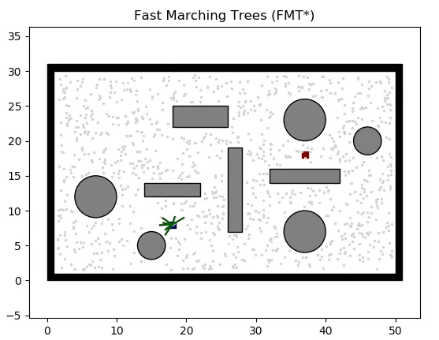</p>

+ 优点：运算速度快；能够找到最短路径
+ 缺点：路径质量可能较差；在高维空间中效果可能不理想

### Batch Informed Trees (BIT*)

+ 优点：通过批量采样提高搜索效率；能够找到最优路径
+ 缺点：运算速度较慢；可能需要大量的存储空间

## 基于参数曲线的路径规划  
### 多项式曲线法  
+ 

### 贝塞尔曲线法  
+ 
  
### B样条曲线  
+ 


## 基于数值最优化的路径规划

### 

## 基于轨迹择优的路径规划

###
