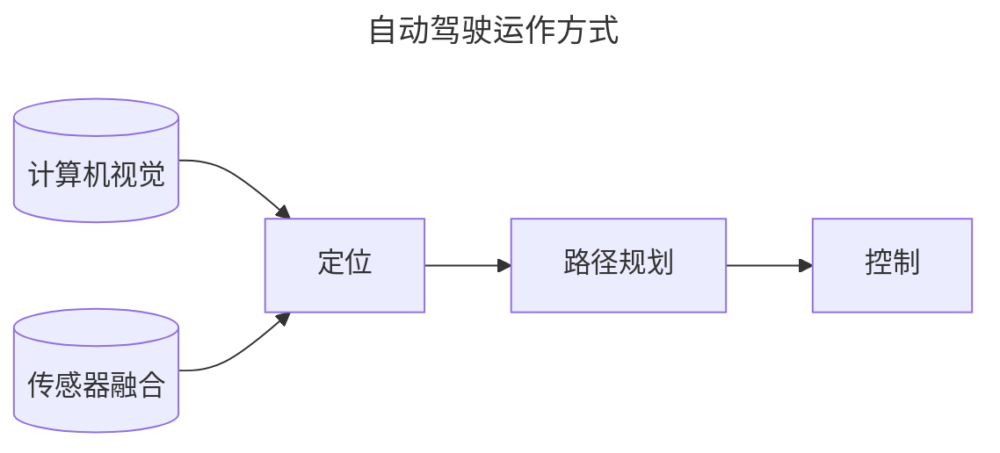
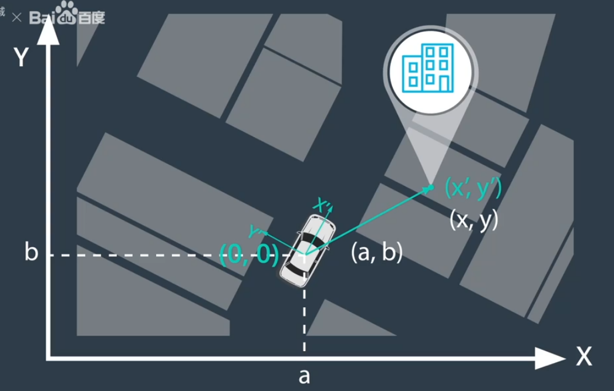
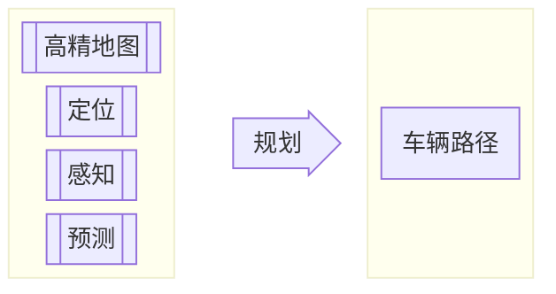
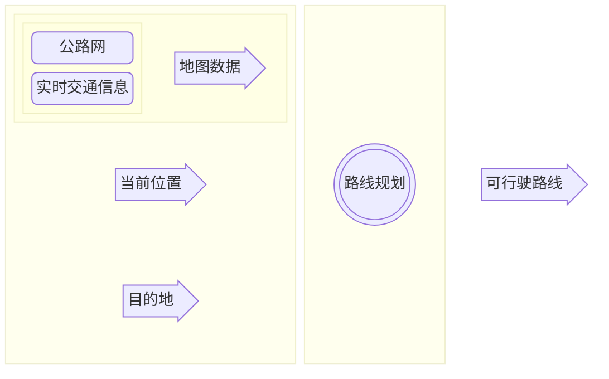
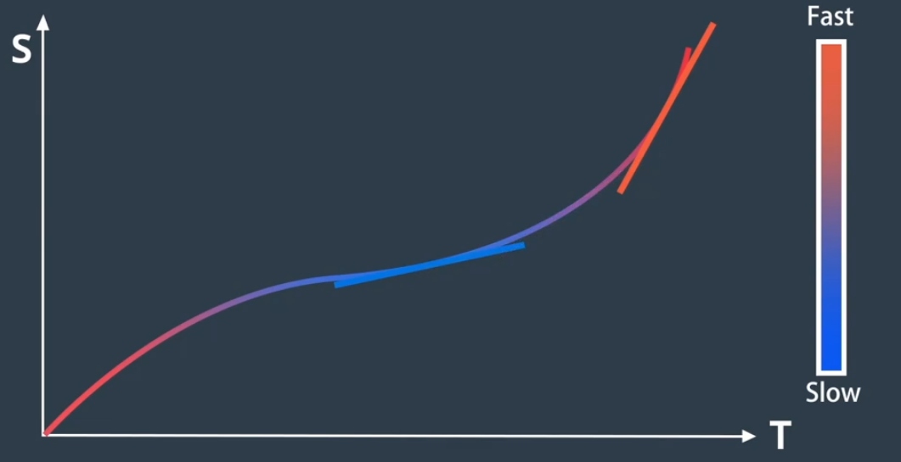
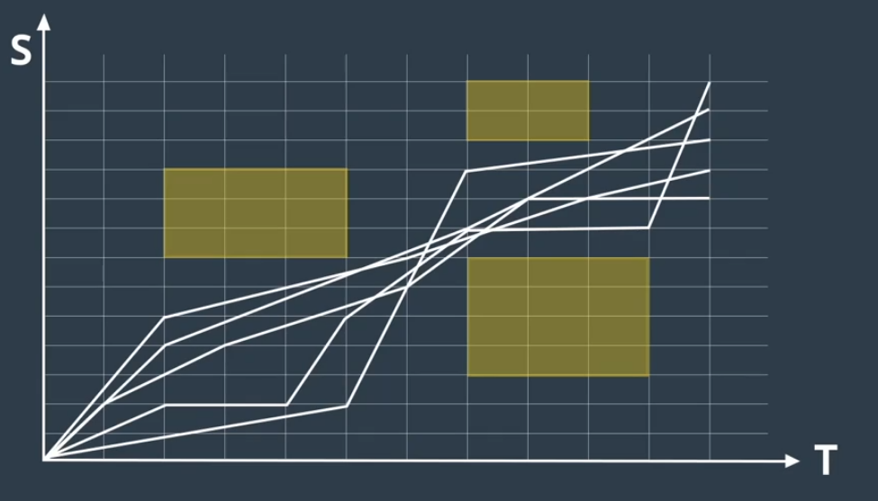
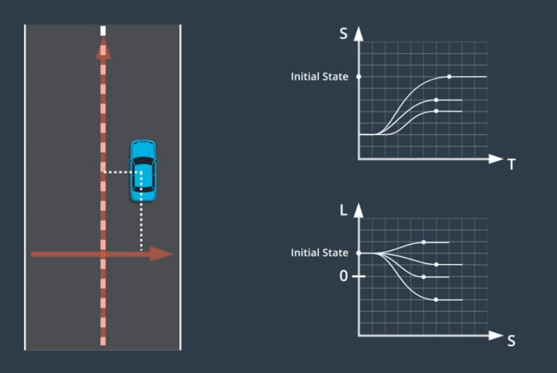
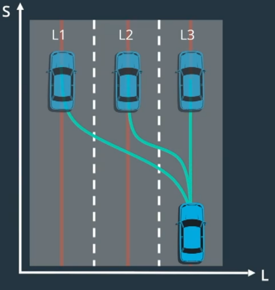
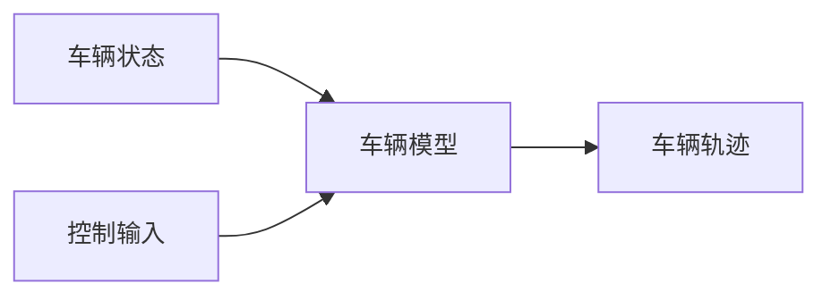

<style>@import url(../../css/auto-number-title.css); </style>

# 自动驾驶技术

## 概览

### 运作方式


> + 计算机视觉：相机  
>   + 建立视觉理解，识别周围环境、物体是什么  
>   + 也可实现较低精度的距离测量 
> + 传感器融合：激光雷达lidar、电磁波雷达radar  
>   + 增加周围物体距离数据、速度数据  
> + 定位：自身精确位置、环境高精地图  
>   + 测量自身与地标（环境中的标志性物体）的距离，与环境地图比较，获得自身位置
> + 路径规划：建立到达目的地的路线  
>   + 建立路径规划器
>       + **预测**其他运动物体的路径
>       + **推算**自身车辆应对措施，建立自身路径
>       + **决策**自身运动，加减速、转向等，受限于速度、加速度等约束条件
> + 控制：沿规划路径行驶时车辆油门、转向、刹车等控制

### Apollo架构

1. reference vehicle platform（参考车辆）
2. reference hardware platform（参考硬件平台）

<p align='center'><br>参考车辆与参考硬件平台</p>

3. open software platform（开放软件平台）
分为三个子层
    + 实时操作系统层(Apollo RTOS)  
      + 实时计算、分析、执行相应操作 
      + ubuntu + apollo 内核 = apollo real time operate system(Apollo RTOS)  
    + 运行时框架层 
      +  是apollo的操作环境  
      +  是ROS（robot operate system）定制版
         + **共享内存**
           + 一次写入，多次读取，数据应用到多个功能模块，同时用于检测、定位、GUI等 
         + **去中心化**
           + 多节点放入公共域，每个节点包含其他节点信息
           + protobuf替代原生ROS message解决通信数据格式兼容性
      +  是Apollo RTOS上运行的软件框架
    + 应用程序模块层 
      + MAP engine（地图引擎）  
      + localization（定位）  
      + perception（感知）  
      + planning（规划）  
      + control（控制）  
      + end to end driving（端到端驾驶）  
      + human machine interface（人机接口）  
4. cloud service platform  
    + 高精地图  
    + 仿真环境 
      + 配置不同的驾驶环境（路型、障碍物、路线、交通灯等等）  
      + 场景运行模式  
        + 多场景并发
        + 单个/多个模块的算法验证
      + 自动评估系统  

        |评估标准||
        |---|---|
        |碰撞检测|闯红灯检测|
        |限速检测|在路检测|
        |到达终点检测|急刹检测|
        |加速度检测|导航检测|
        |路口变道检测|礼让行人检测|
        |不必要刹车检测|停车标志前停车检测|

      + 三维可视化实时路况
        + 实时路况
          + 车道
          + 交通灯
          + 限速
        + 算法输出的可视化信息
          + 路径规划
          + 动态障碍物
          + 无人车规划轨迹
        + 车自身状态信息
          + 速度
          + 方向
          + 刹车油门状态
    + 数据平台  
      + 数据来源  
        + 模拟场景  
        + 记录场景  
      + 数据类型  
        + 交通信号灯数据（定位）  
        + 带边界框的障碍物数据（定位+分类）  
        + 语义分割数据（像素级分类）  
      + ApolloScape数据集
    + 安全  
    + Over-The-Air, OTA  
    + 智能语音系统DuerOS

## 高精地图(High-Definition Map, HD Map)  
### 高精地图 vs 传统地图  
+ 高精地图  
  + 大量辅助驾驶信息  
    + **道路网的精确三维表征**  
      + 交叉路口布局  
      + 路标位置  
      + ...  
    + **语义信息**  
      + 交通灯颜色含义  
      + 道路限速  
      + 左转车道开始位置  
  + 高精度  
    + 传统地图米级精度  
    + 高精地图**厘米级精度**  
### 地图与定位、感知、规划的关系  
+ 定位  
  + 寻找地标  
    + 相机（图像）+激光雷达（三维点云） 
  + 与高精地图一直地标匹配  
    + 预处理  
      + 消除不准确、质量差的数据  
    + 坐标转换  
      + 将不同视角数据转换为统一坐标系  
    + 数据融合  
      + 融合不同车辆和传感器的数据  
+ 感知  
  + 传感器受距离、环境、遮挡等限制  
    + 高精地图提供辅助信息  
    + 高精地图帮助缩小传感器检测范围（ROI） 
      + 提高检测精度、速度
      + 节约计算资源  
+ 规划
  + 寻找合适的行车空间  
  + 帮助规划器确定不同的路线选择  
  + 帮助预测车道上其他车辆未来的位置  
### Apollo高精地图  
+ 道路定义  
+ 交叉路口  
+ 交通信号
+ 车道规则  
+ ...
### 高精地图的构建  
+ 数据采集  
  + 调查车辆
    + GPS 
    + 惯性测量单元  
    + 激光雷达  
    + 摄像机  
+ 数据处理  
  + 整理、分类、清洗  
  + 获得没有任何语义信息或注释的初始地图模板  
+ 对象检测  
  + 目标检测等技术
+ 手动验证  
+ 地图发布  

## 定位(Localization)  
### 简介  
> 让无人驾驶车辆获得自身在世界中的确切位置  
+ 确定车辆在高精地图中的位置  
  + 将传感器获取内容与地图内容进行比对  
    + **车辆坐标系**，地标`M`在车辆坐标系中的坐标 $(x',y')$  
    + **地图坐标系**，地标`M`在地图坐标系中的坐标 $(x,y)$  
    + 通过地标`M`，得到车辆坐标系到地图坐标系的转换关系   
<p align="center"></p>  

### GNSS RTK
+ GNSS(Global NavigaTIon Satellite System，全球卫星导航系统)
> + 中国北斗、GPS、GLONASS、Galileo系统等这些单个卫星导航定位系统的同一称谓，也可指代他们的增强型系统，又指代所有这些卫星导航定位系统及其增强型系统的相加混合体。  
> +   


+ GNSS RTK(Real-time kinematic, 实时差分定位) 和标准GNSS有以下不同：  
  + 精度  
    + 标准 GNSS 定位，也称为独立或单点定位，可提供数米量级的位置精度  
    + RTK 是一种差分 GNSS 技术，可提供厘米级的定位精度  
  + 方法  
    + 标准 GNSS 定位通过测量信号从卫星到接收器的飞行时间来确定用户的位置  
      + 该方法的精度受卫星时钟误差、大气延迟、多径误差等多种因素的影响  
    + RTK 通过使用具有已知位置的固定参考站网络来修正 GNSS 定位  
      + ```mermaid
        flowchart LR
          A["控制站<br>Ground truth (X1,Y1)"] <--GPS Result<br>(X2,Y2)--> B["卫星"]
          B <--GPS Result<br>(X3,Y3)--> C["接收器<br>(X3,Y3)+Error"]
          A <--"Error=(X2,Y2)-(X1,Y1)"--> C
        ```
+ 优缺点  
  + GNSS RTK定位误差在10cm以内  
  + GNSS信号会被障碍物遮挡  
  + 更新频率低，10HZ左右  

### 惯性导航  

$$
\begin{align}
s&=v_{0}t+\frac{1}{2}at^{2} \\
s&=v_{0}t+\int_{t_{0}}^{t+t_{0}}a\:dt
\end{align}
$$

+ 车辆坐标系  
  + 3D加速计
    + 获取车辆坐标系下的加速度测量结果  
+ 转换为世界坐标系  
  + 3D陀螺仪
    + 通过测量旋转轴和外部三个平衡环的相对位置计算车辆在世界坐标系中的位置  

+ 优缺点  
  + 更新频率高，1000HZ左右  
  + 运动误差随时间累计

### 激光雷达定位  
> 通过点云匹配对车辆进行定位  
> 将激光雷达获取到的数据与高精地图连续匹配   

+ ICP(Iterative Closest Point, 迭代最近点)  
  + 有两个待配准点云`P`和`Q` ，在点云 `P`中任意选择一点，记为 $p_i$ ，从点云 `Q` 中查找一个距离其欧氏距离最短的点（可使用KD-Tree进行临近查找），记为 $q_i$ 。 $p_i$  和 $q_i$ 为对应点，得出变换矩阵，经过多次地迭代，最终获得最理想的变换矩阵，使两点云实现重合
  + **<font color='red'>如何找到高精地图中对应的点云？</font>**
+ 滤波算法
  + 直方图滤波算法/误差平方和算法(Sum of Squared Difference,SSD)    
    + 通过**滑动计算**点云与高精地图中点云的误差，选择误差最小位置
  + 卡尔曼滤波  
    + 根据过去的状态和新的传感器测量结果预测当前状态  
      + 根据之前的状态以及对移动距离和方向的估计新的位置 $(x_{1},y_{1})$   
      + 使用传感器测量位置 $(x_{2},y_{2})$   
        + **<font color='red'>这里的传感器测量位置指的是什么？ </font>**
      + 使用概率规划结合 $(x_{1},y_{1})$ 、 $(x_{2},y_{2})$ ，计算新的位置$(x,y)$  

### 视觉定位

### Apollo定位  

## 感知(Perception)  

## 预测(Prediction)  

## 规划(Planning)

### 简介



### 路线规划（Route planning）  
> + **全局路径规划，侧重于如何从地图上的A前往B**  
  


1. 世界到图  
   + 将地图数据格式化为“graph”数据结构  
     + 把线抽象成点，把点精细成线  
     + **节点**：表示路段  
     + **边**：表示路段间的连接  
2. 网格/graph(以A*算法为例)  
   + 计算初始节点到候选节点的成本$g$   
     + 现实世界表示当前位置到下一候选位置的困难程度
   + 计算候选节点到目的地的估计成本（启发式成本）$h$  
     + 现实世界表示候选位置到目的地的距离
   + $minimize\{f=g+h\}$  

> **[!NOTE]**  
> 从路线到轨迹

### 轨迹规划（Trajectory planning）  
> + **局部路径规划，细致决策以生成免碰撞和舒适的可行驶轨迹**  
>   + 该轨迹由一系列点定义
>     + 每个点都有一个关联速度 $v$ 
>     + 每个点都有到达此点的时间戳 $(X,Y,T)$ 

1. 轨迹评估
   + 是否满足车辆动力学约束
   + 是否安全、舒适、高效、合法
2. 轨迹选择  
   + 成本函数：选择成本最低的轨迹  
     + 偏离路中心程度  
     + 潜在碰撞风险  
     + 超出速度限制  
     + 轨迹曲率和加速度影响乘客舒适性  
   + 不同场景使用不同的成本函数   
     + 应对不同驾驶风格和驾驶场景  
3. Frenet坐标系  
   > + 将车道抽象为一条直线，将车辆轨迹抽象为一条曲线  
   + <p align='left'></p>  
       
     + 纵坐标表示在道路中的行驶距离  
     + 横坐标表示汽车偏离中心线的距离  

4. 路径-速度解耦规划方法  
   + 路径规划
     + 生成车辆可行驶的候选路径曲线  
       > 使用成本函数进行评估  
     + 路径生成与选择  
       + 基于图搜索的方法
         + 栅格化环境地图
       + 基于空间采样的方法  
         + 将路段分割成单元格  
         + 对每个单元格内的点随机采样一个点  
         + 将每个点按位置顺序连接起来  
         + 重复以上过程构建多个候选路径   
         + 使用**成本函数**对这些路径进行评估  
<font color="red">   
            > + **与车道中心的偏离**  
            > + **与碰撞物的距离**  
            > + **速度和曲率的变换**  
            > + **对车辆的压力**  
            > + **...**  
</font>  
       + 基于参数曲线的方法  
       + 基于数值最优化方法  
       + 基于轨迹择优的方法  
   + 速度规划  
     > **<font color="red">速度曲线</font>**：在路径上每个点上的速度，速度序列  
     + ST图  
       > + <p align='left'></p>  
         > + 纵坐标表示沿路径位移  
         > + 横坐标表示时间  
         > + 斜率表示速度  
       1. 将ST图离散为多个单元格  
          > 单元格内速度恒定  
       2. 将障碍物绘制为特定时间段内阻挡道路的矩形  
          > + <p align='left'></p>  
       3. 优化算法依据约束条件选择最佳速度曲线  
          1. 法律约束  
             1. 速度限制  
          2. 距离限制  
             1. 与障碍物距离  
          3. 物理限制  
             1. 加速度限制  
   + 平滑离散线段  
     + 离散化  
       > + 路径规划涉及将道路划分为单元格  
       > + 速度规划涉及将ST图划分为单元格  
     + **<font color="red">二次规划</font>**  
       > + 离散方案转换为平滑轨迹  
   + 轨迹生成  
     + 将路径曲线和速度曲线合并构建轨迹  
1. Lattice规划方法  
   ```mermaid
   flowchart LR
      A[空间环境] --> B[Frenet坐标系] --投射--> C[横轴]
      B --投射--> D[纵轴]
      subgraph 三维轨迹
        direction TB
        E[纵向维度]
        G[时间维度]
        F[横向维度]
        E --> G
        G --> F
      end
      C --> 三维轨迹
      D --> 三维轨迹
      subgraph 两个独立二维问题
        direction TB
        H[**ST轨迹图**<br>带有时间戳的纵向轨迹]
        I[**SL轨迹图**<br>相对纵向轨迹的横向偏移]
        H <--> I
      end
      三维轨迹 ==分解==> 两个独立二维问题
   ```
   <p align='center'></p>  
  
     > *建立ST轨迹图——随时间变化的纵向位移*  
     > *建立SL轨迹图——纵向轨迹上每个点的横向偏移*  
     > *选取代价函数最小的轨迹图*
   + ST轨迹终止状态  
     + 巡航  
       + 对图上的点进行采样  
         + 横轴时间  
         + 纵轴速度  
       > *完成规划步骤后定速行驶*  
     + 跟随  
       + 需同时对时间和位置进行采样  
       + 满足在`t`时刻出现在某车后指定位置  
       + 跟随时保持安全距离  
         > *速度和加速度取决于所跟随车辆*  
     + 停止  
       >  对何时何地停止进行采样  
   + SL轨迹终止状态  
     > *假设：任何轨迹停止状态，车辆都稳定与车道中心线对齐*
     > <p align='left'></p>
     + 车的朝向和位置的一阶、二阶导数均为`0`  
       + $V_{Lateral Velocity}=0$
       + $V_{Lateral Acceleration}=0$   
   + 轨迹生成  
     + <p align='left'></p>
     
     ```mermaid
      graph LR
      subgraph 轨迹图
        direction TB
        A[ST轨迹图]
        B[SL轨迹图]
        A ~~~ B
      end
      轨迹图 ==通过S值匹配合并==> C[笛卡尔坐标系]
      ```

     > + **对于换道场景，Lattice算法对目标车道对应的参考线做一次采样+选择的流程**
     > + **本车道和目标车道均能产生一条最优轨迹**
     > + **给换道轨迹的cost上增加额外的车道优先级的cost，再将两条轨迹比较，选择cost较小的那条即可**
   
## 控制(Control)  
### 简介  
> 控制是驱使车辆前行的策略  

+ 控制器的要求
  1. 控制其必须精准，避免偏离目标轨迹  
  2. 控制策略必须具备可行性  
  3. 考虑平稳性、舒适性 ，驱动应当连续  

+ **<font color="red">控制流程</font>**  

  ```mermaid
  ---
  config:
    theme: default
    themeVariables:
      fontFamily: 'Times new Roman'
      fontSize: 14px
  ---
  block-beta
  columns 5
    block:block00:1
      A((("规划模块")))
    end

    blockArrowId1<["目标轨迹"]>(right):1

    block:block02:1
      D((("&nbsp;&nbsp;控制器&nbsp;&nbsp;")))
    end

    blockArrowId2<["车辆状态"]>(left):1
    block:block03:1
      columns 1
      F((("&nbsp;&nbsp;定位模块&nbsp;&nbsp;")))
      G((("内部传感器")))
    end
    space:5
    space:1
    block:block04:3
      columns 3
      H("转向"):1
      I("加速"):1
      J("制动"):1
      space:3
    end
    space:1
    space:5
    E("实际轨迹"):5
    
    block02--"控制器输出的是控制输入"-->block04
    block04--"使车辆通过目标路径点"-->E
    E --"实际轨迹"-->block03
  ```
  
  + **目标轨迹**：由规划模块生成，包含一系列路径点  
    + 每个路径点指定一个位置 $(x,y)$ 和一个参考速度 $v$  
    + 每个时间步都对轨迹进行更新  
  + **车辆状态**：由定位模块和内部传感器获取
    + 车辆当前位置、速度、加速度、转向等  

### PID
> + *Proportion Integration Differentiation，比例积分微分控制*  
> + 线性算法，对于复杂系统效果不佳  
>   + 需要建立不同的PID控制器控制不同的物理量（转向、加速等），难以将横向控制和纵向控制结合  
>   + 依赖于实时误差测量，实时性难以保证  
+ 比例控制  
  + 致力于使运动达到目标速度
  + $a=-K_{p}e$  
+ 微分控制  
  + 致力于使运动处于稳定状态  
  + $a=-K_{p}e-K_{d}\frac{de}{dt}$  
    + 增加阻尼项减少控制器输出的变化速度  
+ 积分控制  
  + 负责纠正系统性错误,对系统累积误差进行惩罚  
  + $a=-K_{p}e-K_{d}\frac{de}{dt}-K_{i}\int edt$


### LQR
> Linear Quadratic Regulator，**线性**二次调节器
> 基于模型的控制器  
> 使用车辆的状态使误差最小化  
+ 用于横向控制的 $\color{red}{\bold{车辆状态集合x=\begin{bmatrix}cte\\\dot{cte}\\\theta\\\dot{\theta}\end{bmatrix}}}$   
  + 横向误差 $cte$   
  + 横向误差的变化率 $\dot{cte}$   
  + 朝向误差 $\theta$  
  + 朝向的变化率 $\dot{\theta}$  
+ 用于横向控制的 $\color{red}{\bold{控制输入集合u=\begin{bmatrix}steering\\throttle\\brake\end{bmatrix}}}$   
  + 转向 $steering$  
  + 加速 $throttle$   
  + 制动 $brake$   

$$
\begin{align}
\dot{x} &= Ax + Bu \\
\Delta{\dot{x}} &= A\Delta{x} + B\Delta{u} 
\end{align}
$$

$$
\begin{equation}
\begin{bmatrix}\dot{cte}\\\ddot{cte}\\\dot{\theta}\\\ddot{\theta}\end{bmatrix} = A\begin{bmatrix}cte\\\dot{cte}\\\theta\\\dot{\theta}\end{bmatrix} + B \begin{bmatrix}steering\\throttle\\brake\end{bmatrix} \\
\end{equation}
$$

> + 捕捉当前状态的变化 $\dot{x}$ 如何受当前状态 $x$ 和控制输入 $u$ 的影响  
> + 尽可能少的使用控制输入，以降低成本  
>   + 保持误差和控制输入的运行总和  
>   + 当前状态误差的负值会由控制输入的正值抵消  
> + 将当前状态 $x$ 乘以自身构造二次项，可抵消负值   

$$
\begin{align}
& w_{1}cte^{2}+w_{2}\dot{cte}^{2}+w_{3}\theta^{2}+w_{4}\dot{\theta}^{2}+\ldots \\
& cost = \int_{0}^{\infty} \left( x^{T}Qx + u^{T}Ru\right)dt  \\
\end{align} 
$$

> Q、R表示权重矩阵

$$
\begin{align}
  & u=Kx \\
\end{align}
$$

> + $K=-R^{-1}B^{T}P$ 为反馈增益矩阵，即为控制器  
> + [推导过程](https://blog.csdn.net/qq_36133747/article/details/123413115)   
> + [LQR](https://zhuanlan.zhihu.com/p/139145957)


### MPC
> Model Predictive Control，模型预测控制，依赖于数学优化，可分为三个步骤  



1. 建立车辆模型  
   1. 估计将一组控制输入应用于车辆时会发生什么  
2. 使用优化引擎计算有限时间范围内的控制输入序列  
   1. 权衡MPC预测未来的时间长度  
      1. 短时间范围，准确度低但快速
      2. 长时间范围，准确度高但慢速
   2. 优化引擎搜索最佳控制输入  
      1. 通过搜索密集数学空间寻找最佳解决方案  
      2. 依赖于车辆模型的约束条件以减小搜索范围  
      3. 根据成本函数对轨迹进行评估  
         1. 估计偏差
         2. 加速度  
         3. 舒适度  
3. 执行计算出的序列中的第一组控制输入  

> 在每个时间步不断重新评估控制输入的最优序列  
> 加入车辆状态因素，比PID更为精准  
> 更为复杂、缓慢、难以实现
> 可使用不同的代价函数，适用于不同场景，可扩展性强  

