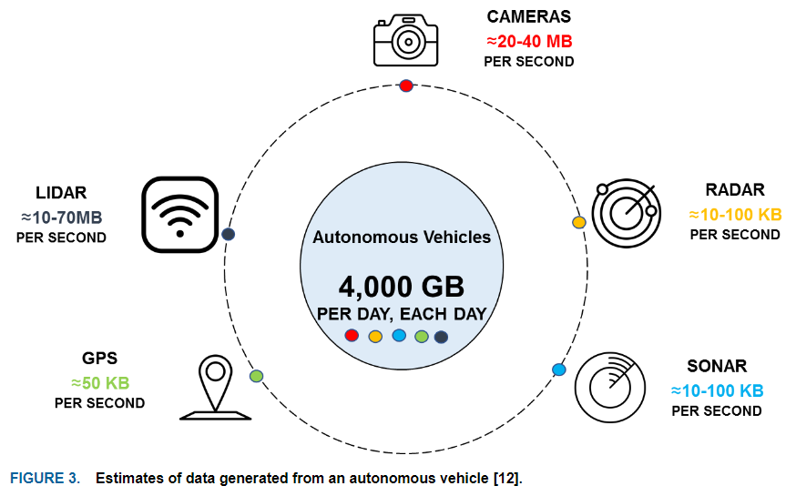

# 控制模型的端到端替代  

## 深度学习在控制算法上的应用
+ 提供**状态估计或改进状态估计**  
+ 用基于深度神经网络的**端到端控制器**取代传统控制器  
  + 取代传统的PID控制器，生成连续或离散的控制动作作为深度网络的输出  
  + 将深度学习与传统控制器结合，形成分层或更好的控制方案  

  

### 传统车辆运动控制  
+ 横向控制  
  + 中心目标是**路径跟踪**，确保车辆精确地遵循预先建立的路径    
    + **传统方法**需要首先识别和建模车辆的动态行为，选择必要的动态变量，并根据物理定律和实际车辆测试数据建立相应的状态方程  
+ 纵向控制      
  + 目的是**保持或修改车辆速度**，使其与预定的速度曲线保持一致  
    + 精确控制速度的复杂性源于车辆的动态行为，包括轮胎和路面之间的非线性相互作用以及速度和转向角变化引起的动态换档等因素  
    + **挑战**：在确保控制精度的同时，调和模型简化和现实世界的复杂性之间的差异  
+ 当前基于动态模型的控制策略面临着几个重大挑战：  
  + 需要精确的系统模型，但由于不同的车辆具有不同的参数，这就需要大量的参数标定工作  
  + 在某些特定路段，如需要较高横向加速度的大弯道，系统可能会出现故障    
  + 这些系统内的决策通常依赖于基于规则的定义，导致发展中的复杂性、主观人为因素的引入以及在确保全面覆盖方面的挑战    

### DRL（深度强化学习）增强车辆控制  
+ 数据驱动方法使车辆能够根据实际驾驶数据学习和优化其控制策略  

## 相关研究  

### 防抱死制动系统（Antilock Brake System, ABS）
- **基于稀疏自编码器的自适应深度神经网络控制器**：
  A new adaptive deep neural network controller based on sparse auto‐encoder for the antilock bracking system systems subject to high constraints
  2021年，Hamou Ait Abbas等
  - 基于稀疏自编码器的自适应深度神经网络观测器估计跟踪误差动态变化率  
  - 鲁棒性深度神经网络（DNN）输出反馈控制方案（OFCS）  
  - 首先采用OFCS对部分已知的防抱死制动（ABS）系统进行线性化，然后利用动态补偿器对线性化后的系统进行镇定

  提出了一种基于 **稀疏自动编码器（Sparse Auto-Encoder，SAE）** 的自适应深度神经网络（Deep Neural Network，DNN）控制器，用于具有高约束的防抱死制动系统（Antilock Braking System，ABS）。其核心原理是结合深度学习混合策略的通用函数逼近特性，设计自适应DNN观测器来估计跟踪误差动态的导数，并构建鲁棒的DNN输出反馈控制方案，以克服参数变化和建模误差的影响。
  1. **ABS系统建模**
      - 建立了实验室ABS装置的数学模型，包括系统运动方程、摩擦系数模型和制动驱动系统方程。
      - 系统运动方程为\(\begin{cases}J_1\dot{x}_1 = F_1 - M_1\\J_2\dot{x}_2 = F_2\end{cases}\)，其中\(F_1 = F_nr_1\mu(\lambda) - d_1x_1 - M_{10}\)，\(F_2 = -F_nr_2\mu(\lambda) - d_2x_2 - M_{20}\)。
      - 摩擦系数模型为\(\mu(\lambda)=\frac{w_4\lambda^p}{a + \lambda^p} + w_3\lambda^3 + w_2\lambda^2 + w_1\lambda\)。
      - 制动驱动系统方程为\(\dot{M}_1 = c_{31}(b_1u + b_2 - M_1)\)，在后续分析中近似为\(M_1 = K_u u\)。
  2. **控制目标**
      - 合成自适应DNN观测器 - 基于鲁棒反馈控制器，防止制动时车轮抱死，使轮胎滑移率\(\lambda\)跟踪给定参考轨迹\(\lambda_{ref}=0.2\)，并在有界误差内。
  3. **控制器设计**
      - **反馈线性化控制**：通过输出反馈控制方案（OFCS）将ABS动力学近似线性化，引入伪控制\(v\)，控制输入信号\(u=\hat{h}^{-1}(y,v)\)，使系统动力学变为\(\begin{cases}\dot{z}_1 = z_2\\\dot{z}_2=\delta + v\end{cases}\)，其中\(\delta\)为反转误差，\(u\)为控制输入，\(y\)为输出，\(z\)为状态。利用\(SHL^{(1N)}NN\)近似反转误差\(\delta\)，并设计自适应输出反馈控制器。
      - **跟踪误差动力学与动态补偿器设计**：定义输出跟踪误差\(e = y^* - y\)，设计动态补偿器\(\begin{cases}\dot{\psi}=\beta_1\psi+\beta_2e\\V_{dc}=\beta_3\psi+\beta_4e\end{cases}\)，使误差动力学\(\dot{E}=A_0E + b_0[D_{NN}-\delta]\)稳定，其中\(D_{NN}\)为自适应控制信号，用于消除非线性项\(\delta\)。
  4. **NN自适应观测器设计**
      - 采用全阶观测器估计跟踪误差动态，观测器方程为\(\begin{cases}\dot{\hat{E}} = A_0\hat{E} + K(\tau-\hat{\tau})\\\hat{\tau}=C_0\hat{E}\end{cases}\)，通过选择增益矩阵\(K\)使\((A_0 - KC_0)\)渐近稳定，从而实现对跟踪误差动态的估计。
  5. **深度神经网络 - 基于自适应控制器**
      - **深度学习与DNN近似**：采用两步法训练深度架构，包括利用自动编码器（AE）生成权重和监督微调过程（SFTP）优化权重。将控制器输入输出信息作为输入数据，反转误差\(\delta\)作为学习目标，通过\(SHL^{(1N)}NN\)近似反转误差\(\delta\)，使控制器能处理高不确定性。
      - **自动编码器（AE）**：AE通过学习输入数据的潜在表示，减少输入与重建数据间的重建误差，引入Kullback-Leibler散度实现隐藏单元的稀疏性，优化目标函数为\(min J(\mu,\hat{\mu})+\gamma\sum_{j=1}^{d}KL(\lambda\parallel\hat{\lambda})\)。
      - **堆叠AE**：堆叠一个AE，采用贪婪逐层无监督预训练（LWPT）算法训练，克服了深度神经网络训练中的梯度分散和局部最优问题。
      - **SFTP过程**：利用AE提取新特征近似反转误差\(\delta\)，优化深度AE参数用于DNN控制，得到优化后的权重和偏差，用于后续自适应NN控制。
      - **自适应NN控制 - 基于DL架构**：自适应信号\(D_{NN}=\hat{W}_{dnn}^T\sigma(N_{0_{dnn}}^T\mu)\)，\(\hat{W}_{dnn}\)根据适应律\(\dot{\hat{W}}_{dnn}=-F_d[2(\hat{\sigma}-\hat{\sigma}'N_{0_{dmn}}^T\mu)E^TPb_0 + k_d(\hat{W}_{dnn}-W_{0_{dan}})]\)更新，使误差动力学\(\dot{E}=A_0E + b_0[\hat{W}_{dnn}^T\sigma(N_{0_{din}}^T\mu)-W_{dnn}^T\sigma(N_{0_{din}}^T\mu)-\epsilon]\)稳定。

  通过上述方法，设计的自适应DNN控制器能够有效应对ABS系统中的高不确定性，实现对车轮滑移率的精确跟踪和车辆的稳定制动。

- **深度强化学习的防抱死制动算法**  
Deep reinforcement learning-based antilock braking algorithm
2022年，V. Krishna Teja Mantripragada
  - 提出一种基于无模型强化学习的防抱死制动控制算法，可适应不断变化的轮胎特性，有效利用轮胎与路面的附着力。
  - 其仿真模型包含制动执行器动力学、传输延迟、轮胎松弛行为、车辆纵向和俯仰动力学等，并用超过350,000个随机轮胎数据进行训练，还提出并行架构以减少训练时间，与博世算法相比，提高了轮胎与路面附着力的利用率，降低了制动距离对轮胎非线性的敏感度.
- **神经网络混合控制系统**
2003年，Chih-Min Lin等
Neural-network hybrid control for antilock braking systems
    开发了一种带有递归神经网络（RNN）观测器的混合控制系统用于ABS 。
    该系统由理想控制器和补偿控制器组成，RNN观测器用于估计系统不确定性，泰勒线性化技术提高了RNN的学习能力，并基于李雅普诺夫函数推导了在线参数自适应律，保证了系统稳定性
 
### 牵引力控制系统（Traction Control System, TCS）
目前直接关于使用深度学习网络完全替代TCS的研究较少，但在相关的车辆动力控制系统研究中，深度学习技术有一定的应用和探索：
- **传感器融合与深度学习**：通过融合车辆的多种传感器数据，如车轮转速传感器、加速度传感器、节气门位置传感器等，利用深度学习网络对车辆的行驶状态进行更准确的感知和判断，从而为TCS的控制提供更精确的输入信息，以实现更优化的牵引力控制。
- **基于深度学习的预测控制**：运用深度学习对车辆未来的行驶状态和路面状况进行预测，提前调整TCS的控制策略，以应对复杂多变的行驶工况，提高车辆的牵引性能和稳定性。例如，预测车辆在加速过程中可能出现的打滑情况，提前调节发动机扭矩或制动驱动轮，防止打滑现象的发生。
 
### 电子稳定程序（Electronic Stability Program, ESP）
深度学习网络在ESP中的应用研究也处于不断发展阶段：
- **车辆动力学建模与深度学习**：利用深度学习网络对车辆的动力学模型进行更精确的建模和参数估计，从而更好地理解车辆在各种工况下的运动状态，为ESP的控制提供更准确的基础模型。通过对大量实际行驶数据的学习，神经网络可以捕捉到车辆动力学中的非线性关系和复杂特性，提高ESP对车辆失稳状态的预测和判断能力。
- **实时控制与深度学习**：将深度学习与实时控制算法相结合，使ESP能够更快速、更准确地对车辆的不稳定状态做出响应。例如，基于深度学习的控制器可以在车辆出现侧滑或失控趋势的瞬间，迅速计算出最佳的制动压力分配和发动机扭矩调整策略，以恢复车辆的稳定性。